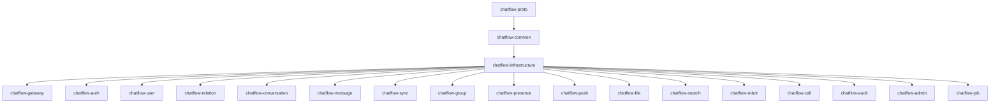

# IM 即时聊天系统 — 后端工程结构设计文档（Maven 多模块）

| 项目   | 内容                                                             |
| ---- | -------------------------------------------------------------- |
| 项目名称 | IM 即时聊天系统（代号：ChatFlow）                                         |
| 文档版本 | V1.0                                                           |
| 文档状态 | 草案评审中                                                          |
| 编写日期 | 2026-10-01                                                     |
| 编写人  | 架构组                                                            |
| 技术体系 | Java 21 + Maven + Spring Boot + gRPC + Netty                   |
| 构建工具 | Maven                                                          |
| 数据库  | MySQL 8.x（ShardingSphere 分片）                                   |
| 缓存   | Redis Cluster                                                  |
| 消息队列 | Kafka                                                          |
| 搜索   | Elasticsearch                                                  |
| 配置中心 | Nacos                                                          |
| 部署   | Docker + Kubernetes                                            |
| 核心协议 | Protobuf / gRPC / WSS                                          |
| 关联文档 | 《IM 即时聊天系统需求文档（PRD）》V1.0、《IM 总体架构设计文档》V1.0、《IM 数据库表结构设计文档》V1.0 |
| 密级   | 内部公开                                                           |

---

## 修订记录

| 版本   | 日期         | 修订人 | 修订说明                                       |
| ---- | ---------- | --- | ------------------------------------------ |
| V0.1 | 2026-10-01 | 架构组 | 初稿：Maven 多模块工程结构、21 个模块职责、分层与包规范、构建与部署     |
| V1.0 | 2026-10-01 | 架构组 | 补全五层划分、Redis 键名统一映射、ACK 语义专项、按 PRD 校准服务优先级 |

---

## 目录

1. 文档说明
2. 设计目标与总体原则
3. 工程分层与模块全景
4. Maven 工程结构
5. chatflow-bom：依赖版本统一
6. chatflow-common：公共能力
7. chatflow-proto：契约定义
8. chatflow-infrastructure：基础设施封装
9. 消息核心模型
10. 服务依赖规则
11. 接入层：chatflow-gateway
12. 认证与用户：chatflow-auth / chatflow-user
13. 关系链：chatflow-relation
14. 会话：chatflow-conversation
15. 消息：chatflow-message
16. Seq 发号设计
17. 多端同步：chatflow-sync
18. 群组：chatflow-group
19. 在线状态：chatflow-presence
20. 离线推送：chatflow-push
21. 文件与富媒体：chatflow-file
22. 搜索：chatflow-search
23. 机器人与开放平台：chatflow-robot
24. 音视频：chatflow-call
25. 审计：chatflow-audit
26. 后台管理：chatflow-admin
27. 定时任务：chatflow-job
28. 单服务内部结构规范
29. Kafka Topic 规划
30. Redis Key 规范
31. 数据库访问原则
32. 配置管理
33. 构建、运行与容器化
34. 服务间通信规约
35. ACK 语义与持久化可靠性边界
36. 消息核心链路全景
37. 服务优先级与分阶段交付
38. 第一阶段推荐工程结构
39. 开发顺序
40. 第一条可运行链路
41. 模块关系全景
42. 与既有文档的差异及待确认问题
43. 附录

---

## 1. 文档说明

### 1.1 编写目的

本文档定义 IM 即时聊天系统的**后端工程结构基线**：Maven 多模块划分、模块职责边界、包与分层规范、依赖规则、通信规约、构建与部署方式，以及分阶段交付顺序。

本文档回答的是"**代码怎么组织、模块怎么切、谁依赖谁**"，不重复回答"业务做什么"（见 PRD）与"系统怎么分层"（见总体架构设计文档）。

### 1.2 读者对象

| 读者角色        | 关注章节               |
| ----------- | ------------------ |
| 后端研发        | 全文（尤其是 4、10、28、34） |
| 架构师 / 技术负责人 | 3、10、35、37、42      |
| 客户端研发       | 7、9、11、29、34、40    |
| 测试工程师       | 33、37、40           |
| SRE / 运维    | 29、33、37           |
| 项目经理        | 37、38、39、40        |

### 1.3 术语与缩写

| 术语      | 说明                           |
| ------- | ---------------------------- |
| BOM     | Bill of Materials，依赖版本统一管理工程 |
| WSS     | WebSocket over TLS           |
| GW      | Gateway，长连接接入网关              |
| Seq     | 会话内单调递增消息序列号                 |
| SyncKey | 账号级增量同步版本号                   |
| Fanout  | 群消息扇出（写扩散 / 读扩散）             |
| Outbox  | 端上本地先行发送模式                   |
| DLQ     | Dead Letter Queue，死信队列       |
| HPA     | Kubernetes 水平自动扩缩容           |
| 逻辑微服务边界 | 代码层已按服务切分，部署时可按需合并或拆分        |

### 1.4 关键设计原则来源

本文档的模块划分必须能回溯到上游文档，不得自行发明：

| 约束                                | 来源                      |
| --------------------------------- | ----------------------- |
| 核心链路与搜索、审计、推送解耦                   | 架构文档 4.2 依赖规则           |
| 接入层、消息层、存储层解耦，服务无状态               | 架构文档 2.2 原则 P-1         |
| 契约先行（Protobuf / OpenAPI 版本化）      | 架构文档 2.2 原则 P-5         |
| 存储先行再 ACK                         | 架构文档 2.2 原则 P-3、ADR-001 |
| 全链路 TraceID 贯通                    | 架构文档 2.2 原则 P-9         |
| 消息按 `conv_id` 分片、会话按 `user_id` 分片 | 架构文档 16.2、数据库文档 4.1     |
| MVP 范围（含"未读与推送""审计基础"）            | 架构文档 13.1 版本规划          |

---

## 2. 设计目标与总体原则

### 2.1 设计目标

本项目采用 **Maven 多模块 + 微服务化** 的后端工程结构，目标是：

1. **边界清晰**：模块边界即服务边界即数据边界，任何人能在 5 分钟内判断一段代码该放哪个模块。
2. **可独立演进**：核心链路服务不因平台能力（搜索、审计、推送）的迭代而重新发布。
3. **可水平扩展**：服务无状态，K8s 中按 CPU / QPS / 连接数 / Kafka Lag 自动扩缩容。
4. **可渐进落地**：支持"Maven 多模块 + 逻辑微服务边界"，避免一上来就维护 20+ 个 Spring Boot 进程。

### 2.2 十条总体原则

1. 公共能力统一抽取，禁止各服务复制粘贴工具类。
2. 业务模块职责单一，一个模块只解决一类问题。
3. 服务之间通过 **gRPC** 通信，通过 **Kafka** 传递事件。
4. 客户端通过 **HTTP / WebSocket / WSS** 接入。
5. Kafka 用于异步消息、削峰与事件传播。
6. Redis 用于高频状态、路由与缓存。
7. MySQL 负责核心业务持久化。
8. Elasticsearch 负责消息搜索。
9. **核心消息链路与搜索、审计、推送等非核心链路解耦**。
10. 服务尽可能无状态，支持 Kubernetes 水平扩展。

### 2.3 总体结构

```text
                         ┌──────────────────────┐
                         │      Client          │
                         │ Android/iOS/Web/PC   │
                         └──────────┬───────────┘
                                    │
                         WSS / HTTPS / Protobuf
                                    │
                                    ▼
                         ┌──────────────────────┐
                         │    API Gateway       │
                         └──────────┬───────────┘
                                    │
                    ┌───────────────┴───────────────┐
                    │                               │
                    ▼                               ▼
             ┌─────────────┐                ┌─────────────┐
             │ IM Gateway   │                │ HTTP API    │
             │ Netty/WSS    │                │ Gateway     │
             └──────┬──────┘                └──────┬──────┘
                    │                              │
                    └──────────────┬───────────────┘
                                   │ gRPC
                                   ▼
              ┌─────────────────────────────────────────┐
              │              Core Services              │
              │                                         │
              │ User │ Auth │ Message │ Conversation    │
              │ Group│ Sync │ Presence│ Push           │
              │ File │ Search│ Robot │ Admin           │
              └───────────────────┬─────────────────────┘
                                  │
             ┌────────────────────┼────────────────────┐
             ▼                    ▼                    ▼
        ┌─────────┐          ┌─────────┐          ┌─────────┐
        │ MySQL   │          │ Redis   │          │ Kafka   │
        └─────────┘          └─────────┘          └─────────┘
                                                     │
                              ┌──────────────────────┼─────────────┐
                              ▼                      ▼             ▼
                           Search                  Push          Audit
                             ES                   Gateway         Service
```

---

## 3. 工程分层与模块全景

### 3.1 五个层次

整个项目划分为五层，共 21 个 Maven 模块。

```text
┌─────────────────────────────────────────────────────────────┐
│ ① 基础层    chatflow-bom / common / proto / infrastructure   │
│             版本统一 · 公共能力 · 契约 · 中间件封装           │
├─────────────────────────────────────────────────────────────┤
│ ② 接入层    chatflow-gateway                                 │
│             长连接接入 · 鉴权 · 心跳 · 路由 · 限流 · 背压      │
├─────────────────────────────────────────────────────────────┤
│ ③ 核心业务层 auth / user / relation / conversation /          │
│              message / sync / group / presence                │
│             消息收发主链路，全部无状态可水平扩展                │
├─────────────────────────────────────────────────────────────┤
│ ④ 平台能力层 push / file / search / robot / call /            │
│              audit / admin                                    │
│             被核心层以异步事件驱动或按需编排，禁止反向同步调用   │
├─────────────────────────────────────────────────────────────┤
│ ⑤ 运维支撑层 chatflow-job                                     │
│             对账 · 补偿 · 归档 · 清理 · 统计                   │
└─────────────────────────────────────────────────────────────┘
```

### 3.2 基础层

```text
chatflow-bom
chatflow-common
chatflow-proto
chatflow-infrastructure
```

负责：

- 版本统一
- 公共 DTO
- 公共异常
- 工具类
- RPC
- Kafka
- Redis
- MySQL
- 日志
- 链路追踪
- Protobuf

### 3.3 模块全景与架构文档服务的映射

| 模块                        | 层次    | 对应架构文档中的服务/组件               | 是否独立部署    |
| ------------------------- | ----- | --------------------------- | --------- |
| `chatflow-bom`            | 基础层   | —（工程治理）                     | 否（POM 工程） |
| `chatflow-common`         | 基础层   | 横切关注点                       | 否（JAR 库）  |
| `chatflow-proto`          | 基础层   | 契约定义                        | 否（JAR 库）  |
| `chatflow-infrastructure` | 基础层   | 中间件与数据层封装                   | 否（JAR 库）  |
| `chatflow-gateway`        | 接入层   | 长连接网关 GW + 路由 Router        | 是         |
| `chatflow-auth`           | 核心业务层 | 认证服务 Auth                   | 是         |
| `chatflow-user`           | 核心业务层 | 用户资料 UProfile               | 是         |
| `chatflow-relation`       | 核心业务层 | 关系链 Friend                  | 是         |
| `chatflow-conversation`   | 核心业务层 | 会话服务 Conv + 已读回执 Receipt    | 是         |
| `chatflow-message`        | 核心业务层 | 消息服务 Msg + 序列发号 Seq         | 是         |
| `chatflow-sync`           | 核心业务层 | 同步服务 Sync                   | 是         |
| `chatflow-group`          | 核心业务层 | 群组服务 Group                  | 是         |
| `chatflow-presence`       | 核心业务层 | 在线状态 Pres                   | 是         |
| `chatflow-push`           | 平台能力层 | 推送服务 Push                   | 是         |
| `chatflow-file`           | 平台能力层 | 文件服务 File + 转码 Transcode    | 是         |
| `chatflow-search`         | 平台能力层 | 搜索服务 Search                 | 是         |
| `chatflow-robot`          | 平台能力层 | 机器人 Robot + OpenAPI/Webhook | 是         |
| `chatflow-call`           | 平台能力层 | 音视频 RTC（信令部分）               | 是         |
| `chatflow-audit`          | 平台能力层 | 审计 Audit                    | 是         |
| `chatflow-admin`          | 平台能力层 | 后台管理与运营                     | 是         |
| `chatflow-job`            | 运维支撑层 | 定时任务与对账                     | 是         |

> **映射说明**：架构文档核心服务层列出的"风控服务 Risk"未单独成模块，其能力落在 `chatflow-message` 内嵌的敏感词过滤组件中（见 15.4 与第 42 章 Q5）。

---

## 4. Maven 工程结构

### 4.1 根工程

推荐根工程：

```text
chatflow/
│
├── pom.xml
│
├── chatflow-bom/
│
├── chatflow-common/
│
├── chatflow-proto/
│
├── chatflow-infrastructure/
│
├── chatflow-gateway/
│
├── chatflow-auth/
│
├── chatflow-user/
│
├── chatflow-relation/
│
├── chatflow-conversation/
│
├── chatflow-message/
│
├── chatflow-sync/
│
├── chatflow-group/
│
├── chatflow-presence/
│
├── chatflow-push/
│
├── chatflow-file/
│
├── chatflow-search/
│
├── chatflow-robot/
│
├── chatflow-call/
│
├── chatflow-audit/
│
├── chatflow-admin/
│
└── chatflow-job/
```

### 4.2 根 pom.xml

```xml
<project>

    <modelVersion>4.0.0</modelVersion>

    <groupId>com.chatflow</groupId>
    <artifactId>chatflow-parent</artifactId>
    <version>1.0.0-SNAPSHOT</version>

    <packaging>pom</packaging>

    <modules>

        <module>chatflow-bom</module>
        <module>chatflow-common</module>
        <module>chatflow-proto</module>
        <module>chatflow-infrastructure</module>

        <module>chatflow-gateway</module>
        <module>chatflow-auth</module>
        <module>chatflow-user</module>
        <module>chatflow-relation</module>
        <module>chatflow-conversation</module>
        <module>chatflow-message</module>
        <module>chatflow-sync</module>
        <module>chatflow-group</module>
        <module>chatflow-presence</module>
        <module>chatflow-push</module>
        <module>chatflow-file</module>
        <module>chatflow-search</module>
        <module>chatflow-robot</module>
        <module>chatflow-call</module>
        <module>chatflow-audit</module>
        <module>chatflow-admin</module>
        <module>chatflow-job</module>

    </modules>

</project>
```

### 4.3 继承与聚合的两条约定

| 约定   | 说明                                                       |
| ---- | -------------------------------------------------------- |
| 聚合   | 根工程 `packaging=pom`，聚合全部子模块，保证 `mvn install` 一次构建全量      |
| 继承   | 业务模块 `parent` 指向根工程（继承插件与属性）；依赖版本指向 `chatflow-bom`（继承版本） |
| 版本   | 全工程统一 `${revision}`（CI-friendly versions），避免 21 处改版本号    |
| 依赖方向 | 只允许"上层依赖下层"，禁止反向（见第 10 章）                                |

---

## 5. chatflow-bom：依赖版本统一

### 5.1 职责

统一管理所有 Maven 依赖版本，避免每个服务重复定义：

```xml
<version>xxx</version>
```

### 5.2 管理内容

```text
Spring Boot
Spring Cloud
gRPC
Protobuf
Netty
Kafka
MySQL Driver
MyBatis
Redis
Redisson
Elasticsearch
Nacos
Micrometer
OpenTelemetry
JUnit
Testcontainers
```


### 5.3 示例

```xml
<dependencyManagement>

    <dependencies>

        <dependency>
            <groupId>org.springframework.boot</groupId>
            <artifactId>spring-boot-dependencies</artifactId>
            <version>${spring-boot.version}</version>
            <type>pom</type>
            <scope>import</scope>
        </dependency>

        <dependency>
            <groupId>io.grpc</groupId>
            <artifactId>grpc-bom</artifactId>
            <version>${grpc.version}</version>
            <type>pom</type>
            <scope>import</scope>
        </dependency>

    </dependencies>

</dependencyManagement>
```

### 5.4 版本属性集中定义

```xml
<properties>
    <revision>1.0.0-SNAPSHOT</revision>
    <java.version>21</java.version>
    <maven.compiler.release>21</maven.compiler.release>

    <spring-boot.version>3.x.x</spring-boot.version>
    <grpc.version>x.x.x</grpc.version>
    <protobuf.version>x.x.x</protobuf.version>
    <netty.version>x.x.x</netty.version>
</properties>
```

> **硬性要求**：业务模块的 `pom.xml` 中**不允许出现任何 `<version>` 标签**（除 `parent` 外）。CI 加一条静态检查规则强制拦截。

---

## 6. chatflow-common：公共能力

### 6.1 逻辑划分

```text
chatflow-common
├── common-core
├── common-result
├── common-exception
├── common-util
├── common-json
├── common-security
├── common-id
├── common-log
└── common-model
```

**实际项目中可以先合并成一个 Maven module**：

```text
chatflow-common
```

后期规模扩大后再按上表拆分。避免一上来就产生 9 个几乎没有内容的模块，增加构建与依赖管理成本。

### 6.2 公共返回结构

```java
public record Result<T>(
        int code,
        String message,
        T data
) {
}
```

与架构文档 10.2 的接口规范一致：统一返回 `{code, message, data, traceId}`，错误码分段 `1xxx` 参数 / `2xxx` 认证权限 / `3xxx` 业务规则 / `4xxx` 限流 / `5xxx` 系统。

### 6.3 公共异常

```java
public class ChatFlowException extends RuntimeException {

    private final String code;

    public ChatFlowException(String code, String message) {
        super(message);
        this.code = code;
    }
}
```

### 6.4 边界约束

`chatflow-common` **不允许依赖** `chatflow-infrastructure`、`chatflow-proto` 之外的任何模块，且不得包含任何业务语义（不得出现 `Message`、`Conversation` 等业务实体）。业务实体属于各业务模块自己的 `domain` 包。

---

## 7. chatflow-proto：契约定义

这是整个微服务体系**最重要的模块**。它定义了端云之间、服务与服务之间的全部契约。

### 7.1 负责内容

```text
gRPC
Protobuf
客户端协议
服务间 RPC
消息实体
```

### 7.2 目录结构

```text
chatflow-proto/
└── src/main/proto/
    ├── common/
    │   ├── common.proto
    │   └── error.proto
    │
    ├── user/
    │   └── user.proto
    │
    ├── auth/
    │   └── auth.proto
    │
    ├── message/
    │   ├── message.proto
    │   └── message_service.proto
    │
    ├── conversation/
    │   └── conversation.proto
    │
    ├── group/
    │   └── group.proto
    │
    ├── sync/
    │   └── sync.proto
    │
    ├── presence/
    │   └── presence.proto
    │
    └── push/
        └── push.proto
```

### 7.3 契约规约（硬性）

1. **字段编号永不复用**：删除字段时使用 `reserved`，防止端云版本错位（架构文档 17.3）。
2. **新增字段一律 `optional`**：保证 N-1 版本兼容，未知字段忽略（架构文档 11.1 第 6 条）。
3. **契约先行**：`chatflow-proto` 单独发布版本，端云可并行开发（原则 P-5）。
4. **指令号（信令）不得复用**，只增不改。
5. **禁止在 proto 中传递 Java 类型**，全部使用跨语言基础类型与嵌套 message。

---

## 8. chatflow-infrastructure：基础设施封装

### 8.1 模块结构

```text
chatflow-infrastructure/
├── mysql
├── redis
├── kafka
├── elasticsearch
├── grpc
├── nacos
├── tracing
└── metrics
```

### 8.2 职责

**MySQL** — 统一：

```text
DataSource
连接池
事务
MyBatis
分页
分库分表
```

**Redis** — 统一：

```text
RedisTemplate
Redisson
分布式锁
Lua
缓存
Stream
ZSet
Hash
```

**Kafka** — 统一：

```text
Producer
Consumer
Topic
Retry
DLQ
消息序列化
```

### 8.3 共享库的升级风险（必须管理）

`chatflow-infrastructure` 是**共享库**，被 17 个可部署模块依赖。这带来一个必须正视的耦合：

```text
infrastructure 升级
        ↓
所有服务同时需要升级
```

**控制措施**：

1. 版本由 `chatflow-bom` 统一，禁止各服务锁定不同版本。
2. 对外接口（`RedisClient`、`MessageProducer` 等抽象）**只增不改**，破坏性变更走大版本。
3. 每次变更必须跑全量服务的集成测试，CI 中对 `infrastructure` 的改动触发全模块构建。
4. 严禁在 `infrastructure` 中放入任何业务逻辑（如"发消息后更新未读"），业务编排属于业务模块。

---

## 9. 消息核心模型

总体架构定义：

```text
MsgEntity {
    msgType
    bizType
    content
}
```

Java 映射：

```java
public class MessageEntity {

    private int msgType;

    private String bizType;

    private byte[] content;
}
```

核心服务只关心：

```text
msgType
bizType
messageId
conversationId
seq
senderId
```

而**不解析具体业务 content**。

这样新增以下类型时不会修改核心消息链路：

```text
图片
文件
语音
视频
卡片
机器人
自定义消息
```

与数据库文档 9.1 的 `content MEDIUMBLOB` 设计一致：`msg_type` + `biz_type` 是唯一需要建索引的维度，新消息类型不需要 ALTER 表（架构文档 6.5）。

---

## 10. 服务依赖规则

### 10.1 推荐依赖方向

```text
                  ┌───────────────┐
                  │ chatflow-proto│
                  └───────┬───────┘
                          │
                  ┌───────▼───────┐
                  │chatflow-common│
                  └───────┬───────┘
                          │
              ┌───────────▼───────────┐
              │   infrastructure      │
              └───────────┬───────────┘
                          │
        ┌─────────────────┼──────────────────┐
        │                 │                  │
        ▼                 ▼                  ▼
      User             Message           Group
        │                 │                  │
        └─────────────────┼──────────────────┘
                          │
                          ▼
                    Conversation
                          │
                          ▼
                        Sync
```

### 10.2 依赖图（Mermaid）



### 10.3 三条铁律

**① 业务服务之间不要形成循环 Maven 依赖。**

```text
message → conversation      ✅ 可以
```

但不要：

```text
message → conversation
conversation → message      ❌ 循环依赖
```

**② 服务之间的数据交互优先使用 gRPC / Kafka，而不是直接依赖对方的 Service 实现。**

即使两个模块存在 Maven 依赖，也只允许依赖对方的 **API 接口包**（`api` 或 `client` 子包），不允许依赖其 `service` / `domain` / `repository` 实现。跨服务取数据走 gRPC。

**③ 依赖方向只允许自上而下。**

```text
接入层 → 核心业务层 → 平台能力层 → 基础层
```

平台能力层（搜索、审计、推送、文件）**只能被核心层异步事件驱动或被网关按需编排，不得反向同步调用核心服务**（架构文档 4.2 依赖规则第 2 条）。

---

## 11. 接入层：chatflow-gateway

IM 长连接接入网关，整个系统的**高并发入口**。

### 11.1 技术栈

```text
Netty
WebSocket
WSS
Protobuf
```

### 11.2 职责

```text
连接建立
连接鉴权
心跳
连接管理
用户绑定
消息接收
消息发送
路由
限流
背压
断线检测
```

### 11.3 包结构

```text
chatflow-gateway/
└── src/main/java/
    └── com.chatflow.gateway/
        ├── GatewayApplication
        │
        ├── config/
        ├── websocket/
        ├── handler/
        ├── protocol/
        ├── connection/
        ├── route/
        ├── heartbeat/
        ├── auth/
        └── limiter/
```

### 11.4 连接模型

```text
userId
   │
   ▼
Gateway Node
   │
   └── Connection
```

Redis `route:{userId}` 记录：

```text
gatewayNodeId
connectionId
deviceId
lastHeartbeat
```

> **键名说明**：`route:{userId}` 为架构文档口径的逻辑键名，工程中的物理键名见第 30 章。

### 11.5 关键实现约束

| 约束                                           | 来源 / 要求      |
| -------------------------------------------- | ------------ |
| 单节点目标承载 5 万连接，硬上限 6 万                        | 架构文档 5.4、5.5 |
| 单连接发送队列上限 256 条，超限降速或断开慢消费者                  | 架构文档 5.2 背压  |
| 单连接消息发送 30 条/秒（突发 60），超限 429 + Retry-After   | 架构文档 5.5     |
| 心跳 30s 客户端 / 90s 网关判定离线；移动端自适应 30s/120s/300s | 架构文档 5.2     |
| 发布期间：摘流 → 广播 `RECONNECT` → 端上无感重连            | 架构文档 5.4     |
| 网关实例无会话级持久依赖，可任意扩缩容与滚动发布                     | 架构文档 5.4     |

---

## 12. 认证与用户：chatflow-auth / chatflow-user

### 12.1 chatflow-auth 认证服务

**职责**

```text
登录
Token
RefreshToken
验证码
设备认证
OAuth2/OIDC
SSO
扫码登录
```

**接口**

```text
POST /auth/login
POST /auth/logout
POST /auth/refresh
POST /auth/device
POST /auth/qrcode
```

**核心对象**

```text
UserToken
DeviceSession
LoginSession
```

**约束**

- Token 策略遵循架构文档 18.2：Access Token 2h / Refresh Token 15 天 + 设备绑定。
- 对应 PRD ACC-001~ACC-012；SSO（ACC-005）与二次验证（ACC-008）为 P1。

### 12.2 chatflow-user 用户服务

**负责**

```text
用户
账号
设备
部门
组织
用户资料
```

**核心表**

```text
im_user
im_user_device
im_department
im_user_department
```

**主要接口**

```text
getUser()
getUsers()
getUserDevices()
updateUser()
```

**约束**

- 组织架构数据由 HR/OA 事件驱动同步，本服务**不提供部门写入口**（数据库文档 6.2）。
- `last_online_at` 由 Presence 下线事件异步批量更新，**不在心跳路径上写库**。

---

## 13. 关系链：chatflow-relation

**负责**

```text
好友
好友申请
黑名单
联系人
```

**对应表**

```text
im_friend
im_friend_request
im_blacklist
```

**业务**

```text
加好友
删除好友
好友申请
同意好友申请
拉黑
解除拉黑
```

**约束**

- 好友关系是高频读（发消息前校验、会话渲染），Redis Set `friend:{userId}` 缓存，MySQL 为准。
- 黑名单在**消息发送前的风控步骤**校验（架构文档 6.1），并在 Redis Set `blacklist:{userId}` 缓存以降低核心链路 RT。
- 防骚扰频控（同一人 24h 最多申请 3 次）由 Redis 计数实现，**不落在 MySQL**。

---

## 14. 会话：chatflow-conversation

**负责**

```text
单聊会话
群聊会话
会话列表
置顶
免打扰
草稿
未读数
已读水位
```

**核心数据**

```text
im_conversation
im_conversation_member
im_conversation_draft
im_read_watermark
```

**Redis**

```text
conv:list:{userId}
unread:{userId}
conv:seq:{convId}
```

**关键实现约束**

| 约束       | 说明                                                                      |
| -------- | ----------------------------------------------------------------------- |
| 已读水位只进不退 | `UPDATE ... SET last_read_seq = GREATEST(last_read_seq, ?)`（数据库文档 10.2） |
| 已读水位唯一来源 | `im_read_watermark`，`im_conversation_member` 不冗余该列                      |
| 未读数允许漂移  | `unread_count` 与 Redis 双写，由 `chatflow-job` 每日校准                         |
| 会话列表首屏   | 读 Redis ZSet `conv:list:{userId}`，miss 回源 MySQL                         |
| 草稿       | 端上本地保存 + 停止输入 3s 后上报，不保证实时性                                             |

---

## 15. 消息：chatflow-message

**整个系统的核心业务模块。**

### 15.1 职责

```text
消息发送
消息持久化
消息查询
消息撤回
消息删除
消息幂等
Seq 分配
消息状态
Kafka 投递
```

**核心表**

```text
im_message_xx        （16 库 × 256 表，hash(conv_id)）
im_message_receipt
im_message_attachment
```

### 15.2 消息发送流程

```text
Client
  │
  │ SEND
  ▼
Gateway
  │
  │ gRPC
  ▼
MessageService
  │
  ├── ClientMsgID 幂等
  │
  ├── 权限检查
  │
  ├── 敏感词检查
  │
  ├── Seq 分配
  │
  ├── 持久化
  │
  └── Kafka
          │
          ▼
      FanoutService
          │
          ▼
        Gateway
          │
          ▼
       Receiver
```

### 15.3 ClientMsgID 幂等

客户端发送 `clientMsgId`，服务端必须支持幂等。唯一键为：

```text
userId + clientMsgId
```

重复请求：

```text
第一次：
ClientMsgID = abc
ServerMsgID = 10001
Seq = 20001

第二次：
ClientMsgID = abc

直接返回：
ServerMsgID = 10001
Seq = 20001
```

防止网络重试导致重复消息。实现为**两级防线**：

| 层级  | 机制                                             | 作用                |
| --- | ---------------------------------------------- | ----------------- |
| 热路径 | Redis `SETNX msg:idem:{clientMsgId}`（TTL 5min） | 拦截绝大多数重复请求，不落库    |
| 兜底  | MySQL `UNIQUE (sender_id, client_msg_id)`      | Redis 失效/重启时的最终防线 |


### 15.4 敏感词与风控

风控能力**内嵌在本模块**，不单独成微服务：

```text
发送前（同步，<5ms）  →  本地 AC 自动机敏感词过滤  →  命中即拦截
发送后（异步）        →  云端 NLP / 图片审核       →  命中则事后撤回或拦截
```

依据架构文档 15 章"本地 AC 自动机实时过滤（发送前同步拦截，<5ms）+ 云端 NLP 审核（异步）"。敏感词库变更通过事件失效本地缓存。

### 15.5 撤回与删除

| 操作     | 实现                                                                          |
| ------ | --------------------------------------------------------------------------- |
| 撤回     | 校验权限（本人/群主/管理员）+ 时间窗 → 更新 `status=2` → Kafka 广播 `msg.recall` → 所有在线端与离线队列同步 |
| 审计模式   | 原消息加密转存审计库，主库仅保留 `status=recalled`                                          |
| 本地删除   | 不经过服务端                                                                      |
| 删除其他设备 | 走 Sync 版本号驱动（`last_del_seq`）                                                |


---

## 16. Seq 发号设计

Seq 是 IM 系统最核心的数据一致性机制之一。

### 16.1 规则

```text
同一个 conversation
        ↓
Seq 单调递增
```

例如：

```text
conv-100

Seq 1
Seq 2
Seq 3
Seq 4
Seq 5
```

Redis `conv:seq:{convId}` 通过原子递增获取 Seq：

```text
INCR conv:seq:{convId}      单条
批量预取（步长 1000）        高并发场景
```

最终持久化靠唯一约束保证不重：

```text
UNIQUE (conv_id, seq)
```

### 16.2 号段预取与宕机处理

| 项        | 方案                                             |
| -------- | ---------------------------------------------- |
| 预取步长     | 1000（Redis `INCRBY`），显著降低 Redis RT 占比          |
| 号段落库     | 预取号段写入 `im_conversation.last_msg_seq` 或独立发号表兜底 |
| Redis 宕机 | **号段不回退**（ADR-002 后果项），重启后从落库水位继续              |
| 号段浪费     | 单次宕机最多浪费 1 个号段（1000），可接受；不回收已发放号段              |
| 顺序保证     | 同一会话写入经**同一 Kafka 分区**（key=convId），分区内有序       |

### 16.3 模块归属

Seq 发号**不单独成 Maven 模块**，而是 `chatflow-message` 内部的 `SeqService` 组件（in-process + Redis），理由见第 42 章 Q3。

---

## 17. 多端同步：chatflow-sync

### 17.1 核心机制

```text
SyncKey
SyncLog
ReadWatermark
```

**Redis**

```text
sync:{userId}
```

**数据库**

```text
im_user_sync
im_sync_log_xx
```

### 17.2 协议

客户端：

```text
SyncRequest
{
    syncKey,
    count
}
```

服务端：

```text
SyncResponse
{
    syncKey,
    hasMore,
    conversations,
    messages,
    ops
}
```

### 17.3 查询

```sql
SELECT *
FROM im_sync_log_000
WHERE user_id = ?
  AND sync_key > ?
ORDER BY sync_key
LIMIT ?;
```

> **字段名修正**：源设计稿此处写 `version > ?`，实际列名为 `sync_key`（数据库文档 12.2 的 `uk_user_sync (user_id, sync_key)`）。

### 17.4 关键约束

| 约束              | 说明                                                |
| --------------- | ------------------------------------------------- |
| syncKey 账号级全局单调 | 任何影响该账号的状态变更都使其 +1                                |
| 保留 7 天          | 按天 RANGE 分区 + `DROP PARTITION` 清理，**禁止 `DELETE`** |
| 超出窗口            | 返回"需全量重建"标志，端上改走会话列表 + 最近消息全量拉取                   |
| 收敛校验            | `hasMore=true` 时客户端循环拉取，最后执行一次收敛性校验               |
| 目标时延            | 已读/置顶/免打扰/删除 ≤2s 跨端一致                             |

---

## 18. 群组：chatflow-group

**负责**

```text
创建群
解散群
加入群
退出群
群成员
群管理员
群公告
群禁言
群权限
```

**核心表**

```text
im_group
im_group_member
```

### 18.1 群消息策略

根据架构文档 ADR-003：

**小群（≤ 200 人）→ Write Fanout（写扩散）**

```text
发送一条消息
        ↓
写入每个成员收件箱
```

优势：

```text
读取简单
未读计算简单
实时性高
```

**大群（> 200 人）→ Read Fanout（读扩散）**

消息只保存一次：

```text
Group Message
     │
     ▼
Group Message Storage
```

成员通过 `lastReadSeq` 读取：

```text
Seq > lastReadSeq
```

避免 `1 条消息 × 5000 人` 造成的巨量写放大。

### 18.2 切换对业务透明

会话读取接口统一聚合"我的收件箱 + 群未读区间"，业务层不感知扇出模型。

### 18.3 join_seq 与历史可见性

```text
群当前 Seq = 10000
用户 A 在 Seq = 8000 加群
        ↓
A 只能看到 Seq >= 8000 的消息
```

拉取统一条件：

```text
seq >= member.join_seq AND seq > member.last_read_seq
```

### 18.4 群权限校验

- 统一走 `GroupAuthService`，缓存 `group:role:{groupId}:{userId}`。
- 高频校验（是否被禁言）结果缓存 5s，容忍短暂不一致。
- FanoutService 按 64 片并行处理，单片失败独立重试（架构文档 6.2）。

---

## 19. 在线状态：chatflow-presence

**负责**

```text
在线
离线
忙碌
离开
设备状态
Gateway 路由
```

**Redis**

```text
presence:{userId}
route:{userId}
```

示例：

```json
{
  "userId": 10001,
  "status": "ONLINE",
  "gateway": "gw-01",
  "device": "android",
  "lastHeartbeat": 1727600000
}
```

Presence 使用 TTL：

```text
TTL = 90s
```

心跳持续刷新。

### 19.1 抗风暴设计（必须实现）

| 机制     | 说明                                              |
| ------ | ----------------------------------------------- |
| 心跳聚合   | GW 每 5s 批量上报存活集合，Redis Pipeline 批量刷新 TTL        |
| 变更广播合并 | 200ms 时间窗内同一用户多次状态变更合并为一次广播（防抖）                 |
| 订阅控制   | 仅会话成员/好友可订阅，单用户被订阅上限 1000                       |
| 两级分片广播 | 按订阅者 hash 分桶 → 批量推送                             |
| 按需订阅   | 用户进入会话才订阅该会话成员，离开即退订                            |
| 降级     | Presence 异常时端上不显示在线状态，**不影响收发**（读取失败返回 unknown） |

> **状态枚举统一**：Redis 中的 `status` 字符串（ONLINE/BUSY/DND/AWAY）需与数据库枚举保持唯一映射，禁止各端自定义。

---

## 20. 离线推送：chatflow-push

**负责**

```text
离线消息
APNs
FCM
Android 厂商 Push
推送聚合
推送重试
角标
```

### 20.1 流程

```text
MessageService
      │
      ▼
判断用户是否在线
      │
 ┌────┴────┐
 │         │
在线       离线
 │         │
 ▼         ▼
Gateway   OfflineQueue
             │
             ▼
          PushService
             │
      ┌──────┼──────┐
      ▼      ▼      ▼
     APNs   FCM   厂商Push
```

### 20.2 关键设计

| 项        | 方案                                        |
| -------- | ----------------------------------------- |
| 策略引擎     | 免打扰？勿扰时段？推送开关？锁屏隐私级别？                     |
| 聚合器      | 同会话 N 条 → 1 条摘要"张三 等 3 人 发来 8 条消息"        |
| 通道选择     | 厂商通道优先，失败回落自建长连接唤醒通道                      |
| 推送去重     | `push:{userId}:{convId}:{window}` 幂等窗口    |
| 频控       | 单用户 60s 内最多 1 条；免打扰会话不产生推送                |
| Token 失效 | 返回 410 自动清理 `im_push_device.token_status` |
| 到达率目标    | ≥ 90%                                     |
| 降级       | 推送全故障时端上依赖长连接（在线不受影响）                     |

> ⚠️ **优先级提示**：本模块承载 PRD NTF-001~NTF-004、NTF-006，**均为 P0**。源设计稿将其列入第二阶段（P1）与 PRD 冲突，本版已修正，见第 37 章。

---

## 21. 文件与富媒体：chatflow-file

**负责**

```text
文件上传
图片
视频
语音
文件下载
文件元数据
临时 URL
对象存储
```

**实际文件存储**

```text
MinIO / OSS / S3
```

**MySQL**

```text
im_file
im_message_attachment
```

**原则**

> MySQL 不保存大型二进制文件，只保存文件元数据。

### 21.1 上传链路

```text
客户端 ─▶ FileService:/sign ─▶ 预签名 URL + uploadId
客户端 ─▶ 分片直传对象存储（绕过网关，避免带宽瓶颈）
完成 ─▶ FileService:/complete {md5, size, type}
         ├─ 秒传：md5 命中 → 直接返回 fileId
         ├─ 安全校验：类型白名单 + 魔数检测 + 大小限制 + 病毒扫描（异步）
         └─ 异步：内容安全审核 → 鉴黄鉴暴 → 不通过则封禁并通知
```

### 21.2 关键设计

| 项    | 方案                          |
| ---- | --------------------------- |
| 断点续传 | 分片 4MB，上传前查询已传分片列表          |
| 秒传   | 客户端先算 MD5（大文件抽样哈希），命中即免传    |
| 缩略图  | 异步生成 3 档（120/320/640）+ 压缩大图 |
| 视频转码 | 异步 H.264 多码率 + 封面帧 + 时长     |
| CDN  | 缩略图/视频走 CDN，URL 带签名防盗链      |
| 去重   | 同 MD5 物理只存一份（引用计数）          |
| 生命周期 | 消息删除后进回收站 30 天再物理删除         |
| 配额   | 用户/群配额（Redis 计数 + 每日校准）     |

> ⚠️ **优先级提示**：本模块承载 PRD MSG-002~MSG-005（图片/语音/视频/文件），**均为 P0**。源设计稿将其列入第二阶段（P1）与 PRD 冲突，本版已修正，见第 37 章。

---

## 22. 搜索：chatflow-search

**技术**

```text
Elasticsearch
Kafka
```

### 22.1 流程

```text
MessageService
      │
      ▼
Kafka
      │
      ▼
SearchService
      │
      ▼
Elasticsearch
```

**负责**

```text
全文搜索
联系人搜索
群搜索
时间搜索
消息类型筛选
```

**搜索服务不能阻塞核心消息发送链路**（架构文档 4.2 依赖规则）。

### 22.2 索引与查询约束

```text
索引: im_msg_{shard}_{yyyyMM}     # 64 分片 + 按月滚动
doc:  { msgId, convId, convType, senderId, memberIds, msgType, content, status, ts }
分词: IK（ik_max_word 建索引 / ik_smart 查询）
```

| 项    | 方案                                      |
| ---- | --------------------------------------- |
| 数据范围 | 仅索引 `status=normal`；撤回/删除/过期异步移除        |
| 权限   | 查询前校验 `userId ∈ memberIds`（索引字段过滤，避免越权） |
| 范围   | 单会话 / 我参与的会话 / 全组织（需授权）                 |
| 性能   | P95 ≤ 500ms；关键词 ≤ 50 字符，禁止前导通配符         |
| 成本   | 冷字段压缩，>180 天索引归档                        |
| 降级   | ES 故障 → 本机搜索兜底 + 服务端搜索降级提示，**不影响收发**    |

> **优先级提示**：SRCH-003（联系人/群搜索）为 **P0**，SRCH-001（全文搜索）为 P1。因此本模块在 MVP 阶段只需提供 P0 部分能力，且**不必依赖 ES**（可用 MySQL 前缀索引实现），全文搜索在 V1.5 启用 ES。详见第 37 章。

---

## 23. 机器人与开放平台：chatflow-robot

**负责**

```text
Bot
Webhook
Card
事件
OpenAPI
第三方业务系统
```

**核心表**

```text
im_bot
im_bot_webhook
```

### 23.1 Webhook 可靠性

```text
签名: HMAC-SHA256（appId + timestamp + nonce + body），时间戳 ±5min
重试: 指数退避 1s/4s/16s/64s… 最多 8 次；非 2xx 或超时(5s) 视为失败
死信: 8 次失败 → 死信队列 + 控制台展示 + 告警
幂等: 事件携带 eventId，要求接收方按 eventId 去重
顺序: 同一会话事件保序（按 convId 分区投递）
```

### 23.2 机器人消息链路

```text
业务系统 ─(OpenAPI, 签名+限流)─▶ OpenGateway ─▶ RobotService
   ├─ 身份：appId + robotId，配额与频控（默认 100 条/分钟/应用）
   ├─ 权限：机器人必须是目标会话成员（发消息前校验）
   └─ 落地：复用核心消息链路（bizType=robot），进入正常投递
```

### 23.3 卡片交互

用户点击 → 上报 `card.action` → RobotService → Webhook 回调业务系统 → 业务返回卡片更新 → 推送回会话（**原地更新，不新增消息**）。业务 3s 未响应则返回"系统繁忙"，卡片置灰。

---

## 24. 音视频：chatflow-call

PRD 中属于 **P1/P2** 能力。

**负责**

```text
音频
视频
群聊
屏幕共享
通话状态
通话记录
```

**架构**

```text
Client
  │
  ▼
CallService
  │
  ▼
Signaling
  │
  ▼
SFU
```

核心 IM 后端只负责：

```text
信令
鉴权
房间
成员
状态
通话记录
```

**媒体流不要经过 IM Gateway。**

### 24.1 资源隔离要求

| 项       | 方案                                    |
| ------- | ------------------------------------- |
| 信令与媒体解耦 | 媒体层可替换（自建 SFU 或第三方 RTC SDK），见 ADR-006 |
| 资源池独立   | SFU 独立资源池，与 IM 核心服务隔离，可独立扩容与下线        |
| 降级      | SFU 整体下线**不影响 IM 收发**                 |
| 呼叫建立    | 邀请经信令路由到被叫在线端；不在线转离线强提醒推送             |
| 超时      | 振铃 60s 未接 → 自动挂断 + 生成"未接来电"消息         |
| 质量自适应   | 按 RTT/丢包动态降码率与分辨率，优先保音频               |

---

## 25. 审计：chatflow-audit

**负责**

```text
操作审计
消息审计
管理员操作
消息调阅
安全审计
合规留痕
```

**架构**

```text
Business Services
       │
       ▼
     Kafka
       │
       ▼
 AuditService
       │
       ├── Audit DB
       │
       └── WORM/Object Storage
```

**审计链路与业务链路物理隔离**（架构文档 15、18.2）。

### 25.1 关键约束

| 约束      | 说明                             |
| ------- | ------------------------------ |
| 不阻塞核心链路 | 只消费 Kafka 事件，核心链路不等待审计结果       |
| 独立实例    | 审计库独立实例 + 独立账号，与业务库物理隔离        |
| 留存      | ≥180 天；金融/政务可延长至 3 年           |
| 消息调阅    | **双人授权**（申请 + 审批），全量留痕且不可删除    |
| 防篡改     | WORM 存储 / 对象存储锁保护              |
| 全链路关联   | `request_id` = TraceID，可还原单次操作 |

> ⚠️ **优先级提示**：本模块承载 PRD ADM-005（审计日志，P0）与架构文档 MVP 范围内的"审计基础"，源设计稿列入第二阶段（P1）与 PRD 冲突，本版已修正，见第 37 章。

---

## 26. 后台管理：chatflow-admin

**负责**

```text
管理员
RBAC
权限
用户管理
群管理
消息管理
敏感词
审核
审计查询
灰度配置
数据看板
```

### 26.1 权限模型

```text
User
 ↓
Role
 ↓
Permission
 ↓
DataScope
```

角色示例：

```text
SUPER_ADMIN
ORG_ADMIN
DEPARTMENT_ADMIN
AUDITOR
OPERATOR
```

与 PRD 3.2 的 RBAC + ABAC 混合模型一致，数据范围支持"全员 / 本部门 / 自定义"。

### 26.2 安全约束

| 约束         | 说明                                             |
| ---------- | ---------------------------------------------- |
| 独立域名 + 强认证 | SSO + 二次验证，内网或专线访问                             |
| 统一鉴权收口     | 所有管理接口强制调用 `AuthzService`，禁止业务侧自行实现鉴权（原则 P-8）  |
| 全量审计       | 后台配置变更、消息检索导出、封禁操作全部落 `im_audit_log`           |
| 灰度开关       | 走配置中心（Nacos）下发，支持热回滚，**不落 `im_system_config`** |

> ⚠️ **优先级提示**：本模块承载 PRD ADM-001~ADM-005、ADM-008、ADM-010（均 P0）与架构文档 MVP 范围内的"管理后台（成员/权限/敏感词/审计基础）"，源设计稿列入第二阶段（P1）与 PRD 冲突，本版已修正，见第 37 章。

---

## 27. 定时任务：chatflow-job

**负责**

```text
消息对账
离线消息补偿
Kafka Lag 检查
数据归档
SyncLog 清理
文件清理
审计归档
数据统计
```

**示例 Job**

```text
MessageReconcileJob
OfflineRetryJob
SyncLogCleanJob
DataArchiveJob
```

### 27.1 任务清单与依据

| Job                   | 频率   | 依据                                            |
| --------------------- | ---- | --------------------------------------------- |
| `MessageReconcileJob` | 5min | 架构文档 6.4 实时对账：`已分配 Seq 数` vs `DB 落库数`，差值超阈值告警 |
| `OfflineRetryJob`     | 1min | 架构文档 6.4 离线对账：扫描"未送达且非离线态"的消息重新投递             |
| `UnreadCalibrateJob`  | 每日   | 数据库文档 8.2：Redis ↔ DB 未读数校准                    |
| `SyncLogCleanJob`     | 每日   | `DROP PARTITION` 清理 7 天前 sync_log             |
| `DataArchiveJob`      | 每日   | >90 天数据迁移冷存储                                  |
| `FileRecycleJob`      | 每日   | 回收站 30 天物理删除                                  |
| `AuditArchiveJob`     | 每日   | 审计归档至 WORM 存储                                 |

> **依赖提示**：`MessageReconcileJob` 是 ADR-001（Kafka 先行 + 异步落库）的**必要补偿机制**，不是可选项。源设计稿将其排除在 P0 之外存在风险，本版已将其纳入 MVP，见第 42 章 Q6。

### 27.2 与架构文档的关键差异

```text
源设计稿：MessageReconcileJob 等任务归属第二阶段
本版建议：对账与离线补偿类任务归属 MVP
```

理由：ACK 条件建立在"写入 Kafka 即视为服务端接收"之上（ADR-001），若没有对账兜底，一旦落库消费者异常，将出现"客户端已显示发送成功、服务端无此消息"的静默数据丢失——违反 PRD G1"消息不丢"目标。

---

## 28. 单服务内部结构规范

### 28.1 标准目录（以 chatflow-message 为例）

```text
chatflow-message/
│
├── pom.xml
│
└── src/
    ├── main/
    │   ├── java/
    │   │   └── com/chatflow/message/
    │   │       │
    │   │       ├── MessageApplication.java
    │   │       │
    │   │       ├── controller/
    │   │       │
    │   │       ├── grpc/
    │   │       │
    │   │       ├── service/
    │   │       │
    │   │       ├── domain/
    │   │       │
    │   │       ├── repository/
    │   │       │
    │   │       ├── mapper/
    │   │       │
    │   │       ├── entity/
    │   │       │
    │   │       ├── dto/
    │   │       │
    │   │       ├── event/
    │   │       │
    │   │       ├── consumer/
    │   │       │
    │   │       ├── producer/
    │   │       │
    │   │       └── config/
    │   │
    │   └── resources/
    │       ├── application.yml
    │       ├── application-dev.yml
    │       ├── application-prod.yml
    │       └── mapper/
    │
    └── test/
```


### 28.2 包职责说明

| 包            | 职责                        | 允许依赖                  |
| ------------ | ------------------------- | --------------------- |
| `controller` | HTTP 接口（管理/查询类），参数校验与结果包装 | `service`、`dto`       |
| `grpc`       | gRPC 服务实现，只做协议转换          | `service`、`dto`       |
| `service`    | 应用服务，编排流程、事务边界、幂等         | `domain`、`repository` |
| `domain`     | 领域模型与领域服务，业务规则唯一归属地       | `repository` 接口       |
| `repository` | 数据访问抽象接口                  | 无（实现在 `mapper`）       |
| `mapper`     | MyBatis Mapper 接口与 XML    | `entity`              |
| `entity`     | 数据库实体（与表一一对应）             | 无                     |
| `dto`        | 传输对象（proto 转换后的 Java 对象）  | 无                     |
| `event`      | 领域事件定义                    | 无                     |
| `consumer`   | Kafka 消费者                 | `service`             |
| `producer`   | Kafka 生产者封装               | `event`               |
| `config`     | Spring 配置类                | 无                     |

**禁止**：`controller` / `grpc` 直接调用 `mapper`；`entity` 泄漏到 `controller` 层。

### 28.3 MessageService 分层

```text
Controller / gRPC
       │
       ▼
Application Service
       │
       ▼
Domain Service
       │
       ├── Repository
       │
       ├── Redis
       │
       └── Kafka
```

接口示例：

```java
public interface MessageService {

    SendMessageResult send(SendMessageCommand command);

    Message getMessage(String messageId);

    List<Message> queryHistory(
            String conversationId,
            long seq,
            int limit
    );

    void recall(String messageId);
}
```

### 28.4 Repository 层

不要让业务代码中到处出现：

```java
redisTemplate.opsForValue()
```

或者：

```java
mapper.selectById()
```

建议：

```java
public interface MessageRepository {

    void save(Message message);

    Optional<Message> findById(String messageId);

    List<Message> findBySeq(
            String conversationId,
            long startSeq,
            int limit
    );
}
```

基础设施负责具体实现。收益：单测可替换实现；分库分表对上层透明；缓存策略集中可改。

---

## 29. Kafka Topic 规划

### 29.1 Topic 清单

```text
msg.send
msg.delivery
msg.receipt
msg.recall

sync.event

group.event

presence.event

push.event

audit.event

search.event
```

### 29.2 消息格式与分区

以 `msg.send` 为例：

```json
{
  "messageId": "msg_10001",
  "conversationId": "conv_10001",
  "senderId": "10001",
  "seq": 100,
  "msgType": 1
}
```

分区键：

```text
hash(conversationId)
```

保证同一会话消息进入同一 Partition，从而保证**分区内有序**（ADR-001）。

### 29.3 投递 Topic 必须按网关节点分片（修正）

架构文档 6.2 的投递链路为：

```text
Kafka(msg.send) ─▶ DeliverService
     ├─ 查在线: Redis route:{userId} → 命中 → 通过 MQ(topic:deliver.{gwNode}) 推给对应 GW → 下发
     ├─ 未命中在线 → 写离线队列 + Redis TTL 缓存
     └─ 触发 PushService
```

因此投递 Topic **不是单一 `msg.delivery`**，而是按网关节点分片：

```text
deliver.{gwNodeId}
```

否则无法做到"把消息推给持有该连接的特定网关节点"，只能全量广播，导致连接数与消息量的乘数放大。

### 29.4 Topic 通用规约

| 项    | 要求                                              |
| ---- | ----------------------------------------------- |
| 副本   | `acks=all` + `min.insync.replicas=2`（架构文档 17.2） |
| 保留   | 7 天（架构文档 16.1）                                  |
| 分区数  | 按峰值吞吐规划（10 万条/s ≈ 12 分区 × 3 副本）                 |
| 死信   | 所有消费组必须配置 DLQ + 告警                              |
| 幂等   | 消费端按业务唯一键（`convId+seq` 或 `eventId`）幂等           |
| 事件命名 | 统一 `{domain}.{action}` 小写点分风格                   |

---

## 30. Redis Key 规范

### 30.1 逻辑键名与物理键名（统一口径）

源设计稿提出统一前缀：

```text
chatflow:{domain}:{object}:{id}
```

而架构文档与数据库设计文档使用**简式逻辑键名**（`presence:{userId}` 等）。两者必须统一，否则会出现同一份数据两套键名、缓存互相打不中的问题。

**统一方案**：

- **逻辑键名**（文档、设计评审、代码常量名）：沿用架构文档口径，保持简短易读。
- **物理键名**（Redis 中实际写入）：`chatflow:{env}:{逻辑键名}`，`env` 用于多环境/多集群共用一个 Redis 时隔离。

| 逻辑键名（架构口径）                      | 物理键名（工程实际）                                        | 类型     | TTL   |
| ------------------------------- | ------------------------------------------------- | ------ | ----- |
| `presence:{userId}`             | `chatflow:prod:presence:{userId}`                 | Hash   | 90s   |
| `route:{userId}`                | `chatflow:prod:route:{userId}`                    | Hash   | 90s   |
| `conv:seq:{convId}`             | `chatflow:prod:conv:seq:{convId}`                 | String | 永久    |
| `unread:{userId}`               | `chatflow:prod:unread:{userId}`                   | Hash   | 永久    |
| `conv:list:{userId}`            | `chatflow:prod:conv:list:{userId}`                | ZSet   | 永久    |
| `msg:idem:{clientMsgId}`        | `chatflow:prod:msg:idem:{senderId}:{clientMsgId}` | String | 5min  |
| `group:role:{groupId}:{userId}` | `chatflow:prod:group:role:{groupId}:{userId}`     | String | 5–30s |
| `sync:{userId}`                 | `chatflow:prod:sync:{userId}`                     | String | 永久    |
| `read:wm:{convId}:{userId}`     | `chatflow:prod:read:wm:{convId}:{userId}`         | String | 7d    |
| `friend:{userId}`               | `chatflow:prod:friend:{userId}`                   | Set    | 永久    |
| `blacklist:{userId}`            | `chatflow:prod:blacklist:{userId}`                | Set    | 永久    |

> **实现方式**：在 `chatflow-infrastructure` 中提供 `RedisKeys` 常量类统一生成键名，禁止业务代码拼接字符串。`msg:idem` 键需包含 `senderId`，与数据库 `uk_client_msg (sender_id, client_msg_id)` 的维度保持一致。

### 30.2 硬性规约

| 规约       | 说明                                       |
| -------- | ---------------------------------------- |
| 禁止裸键     | 业务代码不得定义 `aaa`、`bbb`、`test123` 之类无规范键名   |
| 统一 TTL   | 所有键必须显式声明 TTL（除明确需永久保留的路由/列表类）           |
| 禁止 KEYS  | 生产禁用 `KEYS *`，改用 `SCAN`                  |
| 大 key 管控 | 单 key ≤ 10KB、Hash/ZSet 元素数 ≤ 5000，超限必须拆分 |
| 键名生成收口   | 统一走 `RedisKeys` 常量类，CI 静态检查禁止字面量拼接       |
| TTL 抖动   | 批量写入的同类键 TTL 加随机抖动，防雪崩（架构文档 16.3）        |

---

## 31. 数据库访问原则

核心消息库为 MySQL，按架构文档进行水平扩展。

### 31.1 消息表访问

核心查询**必须**携带分片键：

```sql
SELECT *
FROM im_message_xxx
WHERE conv_id = ?
  AND seq > ?
ORDER BY seq
LIMIT 100;
```

**禁止**深分页：

```sql
ORDER BY create_time
LIMIT 100000, 100;      -- ❌ 禁止
```

改用 seq 游标：

```sql
WHERE conv_id = ? AND seq < ?     -- 向上翻页
ORDER BY seq DESC
LIMIT 50;
```

### 31.2 分片与查询规约

| 规约       | 说明                                                   |
| -------- | ---------------------------------------------------- |
| 必带分片键    | 消息必带 `conv_id`；会话必带 `user_id`；否则 ShardingSphere 强制报错 |
| 禁跨分片扫描   | 跨分片聚合走 ES / ClickHouse                               |
| 唯一约束含分片键 | 如 `uk_conv_seq (conv_id, seq)`，否则分片内无法保证唯一           |
| 深分页      | 全量改造为 seq 游标（架构文档 23.2 技术债）                          |
| 冷热分层     | >90 天数据迁移冷存储，迁移对业务无感                                 |
| 事务       | 会话内顺序依赖 Seq 单调，**不使用分布式事务**；跨实体写用本地事务 + 可靠事件         |

---

## 32. 配置管理

采用 Nacos。

### 32.1 配置文件

```text
application.yml
application-dev.yml
application-test.yml
application-prod.yml
```

### 32.2 环境

```text
dev
test
staging
prod
```

### 32.3 敏感配置

```text
MySQL password
Redis password
Kafka credentials
JWT secret
OSS secret
Webhook secret
```

**禁止提交 Git**。统一由 KMS / Nacos 加密配置下发，本地开发用 `.env`（已加入 `.gitignore`）。

### 32.4 职责边界（重要）

| 配置类型                              | 存放位置                     | 理由            |
| --------------------------------- | ------------------------ | ------------- |
| 功能开关、灰度比例、限流阈值                    | **Nacos**（配置中心）          | 需热更新、需一键回滚    |
| 需持久化与变更审计的业务策略（消息保留期限、群人数上限、邀请开关） | **`im_system_config` 表** | 需审计留痕，且属于业务数据 |
| 连接串、密钥                            | **Nacos 加密配置 + KMS**     | 安全            |

禁止把功能开关同时放在两处，避免"到底哪份生效"的排查成本（数据库文档 17.3）。

---

## 33. 构建、运行与容器化

### 33.1 构建命令

开发环境：

```bash
mvn clean install
```

启动消息服务：

```bash
mvn -pl chatflow-message spring-boot:run
```

启动 Gateway：

```bash
mvn -pl chatflow-gateway spring-boot:run
```

全量构建（跳过测试）：

```bash
mvn clean install -DskipTests
```

### 33.2 生产构建链路

```text
Maven
 ↓
Jar
 ↓
Docker Image
 ↓
Kubernetes Deployment
```

### 33.3 Docker 镜像

```dockerfile
FROM eclipse-temurin:21-jre

WORKDIR /app

COPY target/chatflow-message.jar app.jar

ENTRYPOINT [
    "java",
    "-XX:+UseG1GC",
    "-jar",
    "app.jar"
]
```

> **补充建议**：容器内 JVM 应开启 `-XX:MaxRAMPercentage=75`（替代固定 `-Xmx`），并显式声明 `-XX:+ExitOnOutOfMemoryError`，避免 OOM 后进程僵死。

### 33.4 Kubernetes

每个核心服务独立 Deployment：

```text
chatflow-gateway
chatflow-message
chatflow-sync
chatflow-group
chatflow-presence
chatflow-push
```

通过 HPA 自动扩容，核心指标：

```text
CPU
Memory
QPS
Kafka Lag
WebSocket Connections
RPC Latency
```

### 33.5 扩容阈值

架构文档给出长连接节点容量目标为**单节点约 4.5 万连接**，超过阈值进行扩容和摘流。

| 资源        | 阈值           | 动作           |
| --------- | ------------ | ------------ |
| CPU       | >60% 持续 5min | HPA 扩容       |
| 长连接数      | 单节点 >4.5 万   | 新增 GW + 摘流   |
| Kafka lag | >10 万        | 扩容消费者        |
| MySQL 磁盘  | >70%         | 扩容分片/归档冷数据   |
| Redis 内存  | >70%         | 扩分片 + 优化 TTL |

### 33.6 发布策略

```text
滚动发布   无状态服务 25% → 50% → 100%，每步观察 10min
金丝雀     新版本接 1% 流量，核心 SLI 恶化自动回滚
网关热更新  GW 摘流 → 广播 RECONNECT → 端上无感切换
数据库变更  先加字段/加表 → 双写 → 切读 → 清理，禁止直接改删
协议变更    新增字段向后兼容，指令号不复用，端云 N-1 兼容
```

---

## 34. 服务间通信规约

### 34.1 选型

```text
同步调用      → gRPC
异步调用      → Kafka
客户端 HTTP   → REST
客户端实时通信 → WSS
```

示例：

```text
Gateway
   │
   │ gRPC
   ▼
MessageService
```

而：

```text
MessageService
   │
   │ Kafka
   ▼
SearchService
```

### 34.2 选择判据

| 场景                       | 选择    | 理由          |
| ------------------------ | ----- | ----------- |
| 需要立即拿到结果（鉴权、取用户资料、校验群成员） | gRPC  | 同步语义，强一致    |
| 无需立即返回（搜索索引、审计、推送、未读更新）  | Kafka | 解耦，核心链路不等待  |
| 客户端查询类（会话列表、漫游）          | REST  | 可缓存、可重试、易调试 |
| 客户端实时收发                  | WSS   | 长连接，双向推送    |

### 34.3 强制要求

所有跨服务调用（gRPC 或 HTTP）必须具备**超时、重试、熔断、降级、幂等**五件套（架构文档 2.2 原则 P-6、11.1 第 3 条）：

| 项  | 要求                                          |
| -- | ------------------------------------------- |
| 超时 | 必须显式设置，禁止使用框架默认的"无限等待"                      |
| 重试 | 仅对幂等操作重试，指数退避 + 抖动                          |
| 熔断 | 失败率阈值触发，熔断期间快速失败                            |
| 降级 | 每个核心调用都要定义降级行为（如 Presence 不可用 → 返回 unknown） |
| 幂等 | 写接口必须支持 `requestId` 幂等                      |
| 追踪 | 全链路 TraceID 透传（原则 P-9）                      |

---

## 35. ACK 语义与持久化可靠性边界

> 本章为专项章节。源设计稿在第 47 章末尾提出了一个重要修正，本章将其展开为可落地的规约。

### 35.1 问题的来源

上游文档对"何时向客户端返回 ACK"存在两种表述：

| 来源              | 表述                                                        |
| --------------- | --------------------------------------------------------- |
| 架构文档 ADR-001    | 消息写入 Kafka（`acks=all`，分区键 `convId`）**即返回 ACK**，消费者异步落库    |
| 架构文档 6.1 规则 3   | 消息写入 Kafka 即视为服务端接收并返回 ACK                                |
| 架构文档 2.2 原则 P-3 | **存储先行再 ACK**：未持久化（或入持久化队列）不得向发送端确认                       |
| PRD 6.1 规则 3    | 服务端按会话内 Seq 分配**并持久化后**才返回 ACK，保证不丢                       |
| 源设计稿第 47 章      | 不要把 Kafka `send()` 返回成功直接当作客户端 ACK 条件，应以"达到约定的持久化可靠性边界"为准 |

结论：**"持久化可靠性边界"没有被明确定义**，而实现者极易把 `kafkaTemplate.send()` 返回 `CompletableFuture` 完成当作 ACK 条件——这是最危险的误实现。

### 35.2 本版定义（建议纳入 ADR-009）

**客户端 ACK 的成功条件 = 以下四项全部满足：**

```text
① 幂等键已预占        Redis SETNX msg:idem:{senderId}:{clientMsgId} 成功（或已存在则走幂等返回）
② 权限与风控已通过     会话成员校验 + 黑名单 + 敏感词（同步部分）
③ Seq 已分配且已落库    conv:seq 号段已预取并持久化兜底水位（不回退）
④ 消息已进入可靠队列    Kafka acks=all 且 min.insync.replicas=2 返回成功
```

**不满足 ACK 条件的情况**：

| 情况                                           | 处理                                                         |
| -------------------------------------------- | ---------------------------------------------------------- |
| Kafka `send()` 返回成功但 broker 未达 `acks=all` 确认 | **不算成功**，等待确认或返回可重试错误码                                     |
| Kafka 不可用                                    | 返回 `5xxx` 系统错误 + 端上指数退避重试（1/2/4/8/16s，最多 5 次）              |
| Seq 号段未落库                                    | 不允许 ACK（否则 Redis 宕机后 Seq 可能回退，破坏"不乱序"）                     |
| 异步落库（Kafka → MySQL）失败                        | **不影响已发出的 ACK**，由消费者重试 + 死信告警 + `MessageReconcileJob` 对账补偿 |

### 35.3 为什么异步落库失败仍可 ACK

这是 ADR-001 的核心取舍：ACK 之后 Kafka → MsgStore 的异步落库可能失败。之所以仍可 ACK，是因为：

```text
Kafka 消息保留 7 天
        ↓
落库失败 → 消费者重试 → 仍失败进死信
        ↓
MessageReconcileJob 实时对账：已分配 Seq 数 vs DB 落库数
        ↓
差值超阈值告警 + 离线对账任务重新投递
```

**前提是这三道补偿必须存在且被监控**。若缺少对账任务（源设计稿把 `chatflow-job` 排在最后），"不丢"的保证链条就是断的。

### 35.4 时序（修正后）

```text
Client-A        GW-A         MsgService       SeqService       Kafka        MsgStore
   │              │              │                │             │              │
   │ SEND(msg,cid)│              │                │             │              │
   ├─────────────▶│ 鉴权+解码+限流 │                │             │              │
   │              ├─────────────▶│                │             │              │
   │              │              │ 1.幂等 SETNX   │             │              │
   │              │              │ 2.风控校验     │             │              │
   │              │              ├───────────────▶│ 3.取号段     │              │
   │              │              │◀── seq ────────┤ 4.号段落库   │              │
   │              │              │ 5.构造MsgEntity│             │              │
   │              │              ├── persist(acks=all, min.insync=2) ─▶│        │
   │◀─ACK(cid,seq)┤◀─────────────┤◀── broker 确认（4 项条件齐备）──────┤        │
   │              │              │                │             │──异步落库──▶│
   │              │              │                │             │              │
   │              │              │                │             │ 落库失败→重试→DLQ
   │              │              │                │             │ MessageReconcileJob 对账
```


### 35.5 端上三态与 ACK 的对应

| 端上状态 | 触发条件 |
| --- | --- |
| 发送中 | 本地已入库（Outbox），尚未收到 ACK |
| 发送成功 | 收到 ACK（含 ServerMsgID + Seq） |
| 发送失败 | 重试 5 次仍失败，标红可手动重试 |

送达态、已读态为独立回执，与发送 ACK 解耦（PRD C2C-004 三态回执）。

---

## 36. 消息核心链路全景

最终 Java 后端应形成：

```text
                   Client
                     │
                     ▼
               IM Gateway
                     │
                     ▼
              MessageService
                     │
          ┌──────────┼───────────┐
          │          │           │
          ▼          ▼           ▼
       Idempotent   Seq       Permission
          │          │           │
          └──────────┼───────────┘
                     ▼
                 MySQL/Kafka
                     │
                     ▼
                 Fanout
                     │
          ┌──────────┴───────────┐
          ▼                      ▼
       Online                  Offline
          │                      ▼
          ▼                   PushService
       Gateway                  │
          │                     ▼
          ▼              APNs / FCM / 厂商通道
       Receiver
```

链路跳数与架构文档 2.2 原则 P-2 一致：**收发消息路径上的服务 ≤ 4 跳**，非核心逻辑异步化。

---

## 37. 服务优先级与分阶段交付

> ⚠️ **本章已按 PRD 重新校准。** 源设计稿的阶段划分与 PRD 优先级存在冲突（详见第 42 章 Q-H1），下表为修正后的口径。

### 37.1 校准依据

| 模块 | 源设计稿阶段 | PRD 中的需求优先级 | 修正结论 |
| --- | --- | --- | --- |
| `chatflow-push` | P1 第二阶段 | NTF-001/002/003/004/006 均 **P0** | **提前到 MVP** |
| `chatflow-file` | P1 第二阶段 | MSG-002/003/004/005 均 **P0** | **提前到 MVP** |
| `chatflow-audit` | P1 第二阶段 | ADM-005 **P0**；架构文档 MVP 含"审计基础" | **提前到 MVP** |
| `chatflow-admin` | P1 第二阶段 | ADM-001/002/003/004/008/010 均 **P0** | **提前到 MVP** |
| `chatflow-search` | P1 第二阶段 | SRCH-003 **P0**；SRCH-001/002/004/005 为 P1 | **拆分**：P0 部分（联系人群搜索）进 MVP，全文搜索进 V1.5 |
| `chatflow-job` | 未列入 P0 | ADR-001 的必要补偿机制 | **对账/补偿类进 MVP** |
| `chatflow-robot` | P1 第二阶段 | BOT-001~005 均 P1 | 保持 V1.5 |
| `chatflow-call` | P2 第三阶段 | CALL-001~008 为 P1/P2 | 保持 V2.0 |

### 37.2 MVP（V1.0，P0 全量）

```text
基础层
chatflow-bom
chatflow-common
chatflow-proto
chatflow-infrastructure

接入层
chatflow-gateway

核心业务层
chatflow-auth
chatflow-user
chatflow-relation
chatflow-conversation
chatflow-message
chatflow-sync
chatflow-group
chatflow-presence

平台能力层（P0 部分）
chatflow-push        离线推送与前台通知
chatflow-file        图片/语音/视频/文件消息
chatflow-audit       审计日志（基础）
chatflow-admin       成员/权限/敏感词/封禁
chatflow-search      仅联系人/群搜索（不依赖 ES）

运维支撑层（P0 部分）
chatflow-job         MessageReconcileJob / OfflineRetryJob / UnreadCalibrateJob
```

### 37.3 V1.5（P1）

```text
chatflow-robot       机器人、Webhook、卡片交互
chatflow-search      启用 ES 全文搜索、类型筛选、时间范围检索
chatflow-job         扩展：SyncLogCleanJob / DataArchiveJob / FileRecycleJob
```

### 37.4 V2.0（P1/P2）

```text
chatflow-call        音视频通话、群语音、屏幕共享
多租户、单元化、E2EE 可选、AI 助手
```

### 37.5 MVP 验收底线

MVP 必须能跑通 PRD 15.1 的功能验收抽样：

- 消息三态与重试行为与 PRD 6.1 完全一致
- 断网 10 分钟后恢复，期间收发消息 100% 补齐、无重复、顺序正确
- 跨 3 端登录，已读/置顶/免打扰/删除在 2s 内同步
- 5000 人超级群 @所有人，5s 内 99% 成员收到
- 撤回在所有端与离线推送（未点击前）生效

---

## 38. 第一阶段推荐工程结构

真正开始编码时，可以先控制复杂度：

```text
chatflow/
│
├── chatflow-bom
├── chatflow-common
├── chatflow-proto
├── chatflow-infrastructure
│
├── chatflow-gateway
├── chatflow-auth
├── chatflow-user
├── chatflow-relation
├── chatflow-conversation
├── chatflow-message
├── chatflow-sync
├── chatflow-group
└── chatflow-presence
```

不要一开始就启动：

```text
20+ Spring Boot 服务
```

否则开发、部署、调试成本会非常高。可以采用：

```text
Maven 多模块
+
逻辑微服务边界
+
Docker/K8s 独立部署
```

**逐步拆分。**

> **落地建议**：第一阶段先建 13 个模块（基础 4 + 接入 1 + 核心 8），其余 8 个模块（push / file / search / robot / call / audit / admin / job）**先不建空模块**，避免产生"只有一个空 `pom.xml` 和 `Application` 类"的僵尸模块。等对应功能进入迭代时再创建。

---

## 39. 开发顺序

建议按照依赖关系开发：

```text
01  chatflow-bom
        ↓
02  chatflow-common
        ↓
03  chatflow-proto
        ↓
04  chatflow-infrastructure
        ↓
05  chatflow-auth
        ↓
06  chatflow-user
        ↓
07  chatflow-relation
        ↓
08  chatflow-conversation
        ↓
09  chatflow-message
        ↓
10  chatflow-gateway
        ↓
11  chatflow-sync
        ↓
12  chatflow-group
        ↓
13  chatflow-presence
        ↓
14  push / file / search / audit / admin / job
```

---

## 40. 第一条可运行链路

整个项目第一次不要直接实现全部功能。

优先实现：

```text
登录
 ↓
建立 WSS
 ↓
Gateway 鉴权
 ↓
发送文本消息
 ↓
MessageService
 ↓
生成 ClientMsgID
 ↓
生成 ServerMsgID
 ↓
分配 Seq
 ↓
MySQL 持久化
 ↓
Kafka
 ↓
路由
 ↓
Gateway
 ↓
接收端
 ↓
ACK
```

做到这一条链路后，再增加：

```text
离线
多端同步
群聊
已读
撤回
搜索
推送
文件
机器人
审计
```

### 40.1 第一条链路的验收标准

| # | 验收项 | 通过标准 |
| --- | --- | --- |
| 1 | 端到端收发 | 两个客户端可互发文本，P95 ≤ 200ms（同城） |
| 2 | 幂等 | 同一 `clientMsgId` 重发 10 次，仅落库 1 条，均返回同一 `serverMsgId` + `seq` |
| 3 | 顺序 | 同一会话连发 100 条，接收端按 seq 严格有序，无缺口 |
| 4 | ACK 语义 | 满足第 35 章四项条件才返回 ACK；Kafka 不可用时端上正确进入重试 |
| 5 | 断连补偿 | 断开接收端长连接 10 分钟，重连后消息 100% 补齐、无重复 |
| 6 | 可观测 | 单条消息可用 `traceId` 还原全链路各节点耗时 |

---

## 41. 模块关系全景

最终形成：

```text
                         ┌──────────────┐
                         │    Client    │
                         └──────┬───────┘
                                │
                                ▼
                       ┌────────────────┐
                       │    Gateway     │
                       └───────┬────────┘
                               │
        ┌──────────────────────┼─────────────────────┐
        │                      │                     │
        ▼                      ▼                     ▼
      Auth                  Message                Sync
        │                      │                     │
        │              ┌───────┼────────┐            │
        │              │       │        │            │
        ▼              ▼       ▼        ▼            ▼
      User        Conversation Group  Presence     Redis
        │              │       │        │
        └──────────────┴───────┴────────┘
                       │
                       ▼
                    Kafka
                       │
        ┌──────────────┼───────────────┐
        ▼              ▼               ▼
      Search          Push            Audit
        │              │               │
        ▼              ▼               ▼
       ES          Push Provider    Audit DB


                  ┌──────────────┐
                  │    MySQL     │
                  └──────────────┘

                  ┌──────────────┐
                  │ Object Store │
                  └──────────────┘
```

---

## 42. 与既有文档的差异及待确认问题

### 42.1 高优先级（影响 MVP 范围与可靠性，需评审拍板）

| # | 问题 | 冲突点 | 本版处理 |
| --- | --- | --- | --- |
| **Q-H1** | 服务优先级与 PRD 冲突 | 源设计稿把 push / file / audit / admin 放第二阶段，但这些模块承载的 PRD 需求全部是 **P0** | **已按 PRD 重新校准**（第 37 章）：push / file / audit / admin 提前至 MVP，search 拆分，job 的对账补偿进 MVP |
| **Q-H2** | 客户端 ACK 条件未定义 | 架构文档 ADR-001 说"写 Kafka 即 ACK"，PRD 6.1 说"Seq 分配并持久化后 ACK"，源设计稿第 47 章又提醒不能以 `send()` 返回为准 | **新增第 35 章**定义四项 ACK 条件，建议沉淀为 **ADR-009** |
| **Q-H3** | Redis 键名两套口径 | 源设计稿用 `chatflow:{domain}:{object}:{id}`；架构文档与数据库文档用 `presence:{userId}` 等简式 | **已给出统一映射表**（第 30 章）：逻辑键名沿用架构口径，物理键名加 `chatflow:{env}:` 前缀 |
| **Q-H4** | 对账任务未纳入 MVP | 源设计稿把 `chatflow-job` 排在最后，但 `MessageReconcileJob` 是 ADR-001 的必要补偿 | **已纳入 MVP**（第 27.1、37.2）；否则"消息不丢"链条断裂 |

### 42.2 中优先级（影响工程结构，建议评审确认）

| # | 问题 | 冲突点 | 本版建议 |
| --- | --- | --- | --- |
| Q-M1 | Seq 发号是否独立服务 | 架构文档 4.1 列出独立"序列发号 Seq"服务；本工程 21 个模块中**无 `chatflow-seq` 模块** | 建议**不单独成模块**，作为 `chatflow-message` 内的 `SeqService` 组件。理由：Seq 与消息写入强耦合、要求极低延迟，独立成服务会多一跳 RPC，直接影响 P95 ≤ 200ms 目标。架构文档的"独立服务"应理解为"独立的逻辑职责与发号存储"，而非独立进程 |
| Q-M2 | 路由 Router 是否独立服务 | 架构文档 4.1、4.2 将 Router 列为接入层独立组件；源设计稿把路由放在 `gateway/route/` 包内 | 建议**路由表读写封装在 `chatflow-infrastructure`，由 Gateway 内嵌调用**。理由同上：投递路径上每多一跳都影响 P95；路由表本身在 Redis，无需独立进程 |
| Q-M3 | 风控 Risk 无独立模块 | 架构文档 4.1 核心服务层列出"风控服务 Risk"；本工程无对应模块 | 建议**内嵌 `chatflow-message`**（本地 AC 自动机同步拦截 + 云端 NLP 异步），与架构文档 15 章实现一致。若后续出现独立的业务风控（频率限制、异常行为识别），再抽模块 |
| Q-M4 | 投递 Topic 命名 | 架构文档为 `deliver.{gwNode}`（按网关节点分片）；源设计稿为单一 `msg.delivery` | **采用 `deliver.{gwNodeId}`**（第 29.3）。单一 topic 会导致无法定向投递，只能全量广播 |
| Q-M5 | `sync_log` 列名 | 源设计稿 SQL 写 `version > ?`；数据库文档列名为 `sync_key` | **统一为 `sync_key`**（第 17.3） |
| Q-M6 | 共享库升级耦合 | `chatflow-infrastructure` 被 17 个可部署模块依赖，一次变更触发全量升级 | 已在第 8.3 明确控制措施：版本由 bom 统一、对外接口只增不改、CI 全模块构建 |
| Q-M7 | 僵尸模块风险 | 第一阶段建 21 个模块会产生大量空模块 | 第 38 章建议**先建 13 个**，其余按迭代创建 |

### 42.3 低优先级（细节规约）

| # | 问题 | 建议 |
| --- | --- | --- |
| Q-L1 | `im_message` 表名示例无分片后缀 | 文档示例统一写 `im_message_xxx`，实际表名按 `hash(conv_id) % 256` 生成 |
| Q-L2 | Presence 状态枚举 | Redis 中的 `ONLINE/BUSY/DND/AWAY` 需与数据库枚举建立唯一映射表，禁止各端自定义字符串 |
| Q-L3 | 单服务包结构缺 `job` 包 | 若某服务内嵌定时任务，需补 `job/` 包并纳入第 28.2 的依赖规约 |
| Q-L4 | 容器 JVM 参数 | 建议 `-XX:MaxRAMPercentage=75` + `-XX:+ExitOnOutOfMemoryError`（第 33.3） |

---

## 43. 附录

### 43.1 模块清单速查

| # | 模块 | 层次 | MVP | 独立部署 |
| --- | --- | --- | --- | --- |
| 1 | `chatflow-bom` | 基础层 | ✔ | 否 |
| 2 | `chatflow-common` | 基础层 | ✔ | 否 |
| 3 | `chatflow-proto` | 基础层 | ✔ | 否 |
| 4 | `chatflow-infrastructure` | 基础层 | ✔ | 否 |
| 5 | `chatflow-gateway` | 接入层 | ✔ | 是 |
| 6 | `chatflow-auth` | 核心业务层 | ✔ | 是 |
| 7 | `chatflow-user` | 核心业务层 | ✔ | 是 |
| 8 | `chatflow-relation` | 核心业务层 | ✔ | 是 |
| 9 | `chatflow-conversation` | 核心业务层 | ✔ | 是 |
| 10 | `chatflow-message` | 核心业务层 | ✔ | 是 |
| 11 | `chatflow-sync` | 核心业务层 | ✔ | 是 |
| 12 | `chatflow-group` | 核心业务层 | ✔ | 是 |
| 13 | `chatflow-presence` | 核心业务层 | ✔ | 是 |
| 14 | `chatflow-push` | 平台能力层 | ✔（P0） | 是 |
| 15 | `chatflow-file` | 平台能力层 | ✔（P0） | 是 |
| 16 | `chatflow-search` | 平台能力层 | 部分（P0 部分） | 是 |
| 17 | `chatflow-audit` | 平台能力层 | ✔（P0 基础） | 是 |
| 18 | `chatflow-admin` | 平台能力层 | ✔（P0） | 是 |
| 19 | `chatflow-job` | 运维支撑层 | 部分（对账补偿） | 是 |
| 20 | `chatflow-robot` | 平台能力层 | ✘（V1.5） | 是 |
| 21 | `chatflow-call` | 平台能力层 | ✘（V2.0） | 是 |

### 43.2 包命名规约

| 项 | 规约 |
| --- | --- |
| 基础包 | `com.chatflow.{module}` |
| 例 | `com.chatflow.message`、`com.chatflow.gateway` |
| 子包 | `controller` / `grpc` / `service` / `domain` / `repository` / `mapper` / `entity` / `dto` / `event` / `consumer` / `producer` / `config` / `job` |
| 禁止 | 包名使用缩写（`svc`、`mgr`、`util2`）；跨模块直接引用对方 `service` / `domain` / `repository` 实现 |

### 43.3 三条不可违反的工程底线

```text
① 业务模块的 pom.xml 中不得出现 <version>（除 parent）
② 业务服务之间不得形成循环 Maven 依赖
③ 平台能力层不得反向同步调用核心业务层
```

### 43.4 评审签字

| 角色 | 姓名 | 评审结论 | 日期 |
| --- | --- | --- | --- |
| 首席架构师 | | □通过 □有条件通过 □不通过 | |
| 后端负责人 | | □通过 □有条件通过 □不通过 | |
| 客户端负责人 | | □通过 □有条件通过 □不通过 | |
| SRE 负责人 | | □通过 □有条件通过 □不通过 | |
| 测试负责人 | | □通过 □有条件通过 □不通过 | |
| 技术总监 | | □批准实施 | |

---

*— 文档结束 —*
