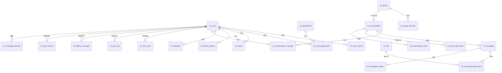

# IM 即时聊天系统 — 数据库表结构设计文档

| 项目名称 | IM 即时聊天系统（代号：ChatFlow） |
| --- | --- |
| 文档版本 | V1.0 |
| 文档状态 | 草案评审中 |
| 编写日期 | 2026-10-01 |
| 编写人 | 架构组 |
| 关联文档 | 《IM 即时聊天系统需求文档（PRD）》V1.0、《IM 总体架构设计文档》V1.0 |
| 密级 | 内部公开 |

---

## 修订记录

| 版本 | 日期 | 修订人 | 修订说明 |
| --- | --- | --- | --- |
| V0.1 | 2026-10-01 | 架构组 | 初稿：26 张核心表逻辑模型、分片路由、Redis 键设计、关键索引 |

---

## 目录

1. 文档说明
2. 设计原则与总体划分
3. 核心实体关系
4. 分库分表与存储路由
5. 账号与设备
6. 组织架构
7. 关系链
8. 会话
9. 消息
10. 消息状态
11. 群组
12. 多端同步
13. 文件
14. 离线与推送
15. 收藏
16. 审计
17. 机器人与配置
18. Redis 键设计
19. 关键索引清单
20. V1 落地路线：渐进式分片
21. 与既有文档的差异及待确认问题
22. 附录

---

## 1. 文档说明

### 1.1 编写目的

本文档定义 IM 即时聊天系统的数据库逻辑模型与物理设计基线，包括表结构、字段语义、索引策略、分库分表规则与缓存键设计，作为研发建库建表、DAO 层实现、DBA 评审与容量规划的依据。

本版聚焦 **P0 核心链路的 26 张表**，P2 功能（多租户计费、群投票、阅后即焚等）不在本版范围内。

### 1.2 读者对象

| 读者角色 | 关注章节 |
| --- | --- |
| 后端研发 | 全文 |
| 架构师 / DBA | 2、4、9、12、19、20、21 |
| 客户端研发 | 9、10、12、18 |
| 测试工程师 | 4、5–17 |
| SRE / 运维 | 4、12、20 |
| 安全 / 合规 | 9、16、21 |

### 1.3 设计约束来源

本文档的每一项关键设计都必须能回溯到上游文档，不得自行发明：

| 约束 | 来源 |
| --- | --- |
| 消息排序用**会话级 Seq**，不用全局 ID | 架构文档 ADR-002、PRD 9.2 |
| 消息写入 **Kafka 先行、异步落库** | 架构文档 ADR-001 |
| 幂等键 `clientMsgId` + Redis SETNX + MySQL 唯一索引兜底 | 架构文档 6.1、PRD C2C-002 |
| 已读水位**只进不退** | 架构文档 7.3、PRD SYNC-005 |
| 群成员 `join_seq` 限制历史消息可见 | 架构文档 8.2 |
| Presence 走 Redis + TTL，**不实时刷 MySQL** | 架构文档 ADR-005、9.2 |
| `sync_log` 按用户分片、保留 7 天 | 架构文档 ADR-004、16.1 |
| 消息按 `conv_id` 哈希 **16 库 × 256 表** | 架构文档 16.2 |
| 会话按 `user_id` 哈希 **8 库 × 64 表** | 架构文档 16.2 |
| 审计链路与业务链路物理隔离 | 架构文档 15、18.2 |

### 1.4 命名与字段规约

| 规约 | 内容 |
| --- | --- |
| 表名前缀 | 统一 `im_`，小写下划线，单数名词 |
| 分片表后缀 | 三位十进制，如 `im_message_000` ~ `im_message_255` |
| 主键 | `BIGINT`，雪花算法生成（趋势递增、含机房位）；不使用数据库自增 |
| 时间字段 | 统一 `DATETIME(3)`（毫秒精度），**存 UTC**，展示层按客户端时区转换 |
| 状态字段 | `TINYINT`，`1` 起为正语义（如 1 正常 / 2 冻结），`0` 仅用于"待处理"类语义 |
| 布尔语义 | 用 `TINYINT(0/1)`，不用 `BOOLEAN`（MySQL 中即 TINYINT(1)，语义不清） |
| 公共字段 | 所有业务表带 `created_at`、`updated_at`；有软删语义的表带 `status` |
| 金额/计数 | 计数类冗余字段（如 `unread_count`）一律标注"异步校准" |
| 字符集 | `utf8mb4` + `utf8mb4_0900_ai_ci` |
| 存储引擎 | `InnoDB` |

---

## 2. 设计原则与总体划分

### 2.1 六条设计原则

1. **顺序依赖 Seq，不依赖 ID**：`message_id` 只做唯一标识，排序、漫游、增量拉取一律基于 `(conv_id, seq)`。
2. **写热点与读模型分离**：会话列表读、未读读走 Redis；写走 MySQL 或 Kafka 异步落库。
3. **高频状态不进主库**：Presence、路由、连接态只在 Redis；MySQL 仅存"最近在线时间"这类低频快照。
4. **冗余字段必须可校准**：任何冗余（未读数、会话摘要）都要有对账任务，且允许短暂不一致（≤5s）。
5. **可扩展字段不 ALTER 表**：新消息类型走 `msg_type` + `biz_type` + `content`，核心链路不解析 `content`。
6. **分片键首期锁定**：`conv_id`（消息）、`user_id`（会话）在第一版确定，后期不可变更。

### 2.2 26 张核心表清单

| 模块 | 核心表 | 优先级 | 分片 |
| --- | --- | --- | --- |
| 用户 | `im_user`、`im_user_device` | P0 | 否 |
| 组织 | `im_department`、`im_user_department` | P0 | 否 |
| 好友 | `im_friend`、`im_friend_request`、`im_blacklist` | P0 | 否 |
| 会话 | `im_conversation`、`im_conversation_member` | P0 | 按 `user_id` |
| 消息 | `im_message_xx` | P0 | 按 `conv_id` |
| 消息状态 | `im_message_receipt`、`im_read_watermark` | P0 | 按 `conv_id` |
| 群组 | `im_group`、`im_group_member` | P0 | 否 |
| 同步 | `im_user_sync`、`im_sync_log_xx` | P0 | 按 `user_id` |
| 文件 | `im_file`、`im_message_attachment` | P0 | 附件按 `conv_id` |
| 收藏 | `im_message_favorite` | P1 | 按 `user_id` |
| 草稿 | `im_conversation_draft` | P1 | 按 `user_id` |
| 推送 | `im_push_device`、`im_offline_message` | P0 | 按 `user_id` |
| 审计 | `im_audit_log` | P1 | 按 `created_at` 分区 |
| 机器人 | `im_bot`、`im_bot_webhook` | P1 | 否 |
| 配置 | `im_system_config` | P1 | 否 |

> 合计 26 张（含逻辑表与其分片形态）。P2 能力（群投票、阅后即焚、多租户计费）本版不建表。

---

## 3. 核心实体关系

### 3.1 主关系链

```
                         ┌──────────────┐
                         │   im_user    │
                         └──────┬───────┘
                                │
             ┌──────────────────┼──────────────────┐
             │                  │                  │
             ▼                  ▼                  ▼
       im_user_device      im_friend          im_group_member
                                │                  │
                                │                  ▼
                                │             ┌───────────┐
                                │             │  im_group │
                                │             └─────┬─────┘
                                │                   │
                                └──────┐            │
                                       ▼            ▼
                               im_conversation ◀────┘
                                       │
                              ┌────────┴────────┐
                              ▼                 ▼
                       im_conversation_member  im_message
                                                  │
                            ┌─────────────────────┼──────────────┐
                            ▼                     ▼              ▼
                     receipt/read          attachment       favorite
```

### 3.2 最重要的那条链

```
User → Conversation → Message → Seq
```

**不要用 `message_id` 作为消息排序依据。** 架构文档 ADR-002 已明确采用会话级 `Seq`：

- `seq` 由 `SeqService` 按 `conv:seq:{convId}` 原子 `INCR` 分配，批量预取步长 1000；
- 端上按 `seq` 归并插入，检测断档即触发缺口补齐；
- 漫游分页以 `seq` 为游标（禁止 `OFFSET` 大偏移）；
- `message_id`（服务端雪花 ID）仅用于全局唯一标识与排障检索。

### 3.3 ER 图（Mermaid）



---

## 4. 分库分表与存储路由

### 4.1 分片规则

```
消息（im_message_xx）
    h = hash(conv_id)
    dbIndex    = h % 16      →  16 个库
    tableIndex = h % 256     →  每个库 256 张表

会话（im_conversation / im_conversation_member / im_read_watermark / im_conversation_draft）
    h = hash(user_id)
    dbIndex    = h % 8       →  8 个库
    tableIndex = h % 64      →  每个库 64 张表

同步日志（im_sync_log_xx）
    h = hash(user_id)
    按 user_id 分片 + 按 created_at 按天 RANGE 分区
```

### 4.2 分片键选择理由

| 表 | 分片键 | 理由 |
| --- | --- | --- |
| 消息 | `conv_id` | 99% 的查询是"某会话的最近 N 条 / 指定 seq 区间"，天然带 `conv_id` |
| 会话类 | `user_id` | 99% 的查询是"我的会话列表"，天然带 `user_id` |
| 同步日志 | `user_id` | 增量拉取固定为"某用户的 sync_key 之后" |

### 4.3 硬性规约

1. **任何查询必须携带分片键**，禁止跨分片扫描（ShardingSphere 配置为强制校验）。
2. **跨分片聚合走 Elasticsearch / ClickHouse**，不查 MySQL（全局消息搜索、运营看板）。
3. **唯一约束必须包含分片键**，否则 ShardingSphere 无法在分片内保证唯一性——这是 `uk_conv_seq (conv_id, seq)` 必须包含 `conv_id` 的原因。
4. **冷热分离**：`created_at` > 90 天的消息迁移至冷存储，迁移对业务无感。
5. **扩容**：一致性哈希 + 双写迁移工具，迁移期双读双写比对；首期即预留 S3 阶段分片翻倍的空间。

### 4.4 逻辑库划分建议

```
MySQL
  │
  ├── account_db        →  im_user、im_user_device、im_department、im_user_department
  ├── relation_db       →  im_friend、im_friend_request、im_blacklist
  ├── conversation_db   →  im_conversation、im_conversation_member、
  │                        im_read_watermark、im_conversation_draft
  ├── message_db(×16)   →  im_message_000~255、im_message_attachment、
  │                        im_message_receipt、im_offline_message
  ├── sync_db           →  im_user_sync、im_sync_log_xx
  ├── group_db          →  im_group、im_group_member
  ├── file_db           →  im_file
  ├── bot_db            →  im_bot、im_bot_webhook、im_system_config
  └── audit_db(独立实例) →  im_audit_log
```

> 审计库必须独立实例，与业务库物理隔离（架构文档 15 章）。

---

## 5. 账号与设备

### 5.1 im_user 用户表

```sql
CREATE TABLE im_user (
    id              BIGINT       NOT NULL COMMENT '用户ID（雪花）',
    username        VARCHAR(64)  NOT NULL COMMENT '账号',
    nickname        VARCHAR(64)  NOT NULL COMMENT '昵称',
    avatar_url      VARCHAR(512) DEFAULT NULL COMMENT '头像',
    phone           VARCHAR(32)  DEFAULT NULL COMMENT '手机号（加密存储）',
    email           VARCHAR(128) DEFAULT NULL COMMENT '邮箱',
    employee_no     VARCHAR(64)  DEFAULT NULL COMMENT '工号',

    signature       VARCHAR(255) DEFAULT NULL COMMENT '个性签名',
    job_title       VARCHAR(128) DEFAULT NULL COMMENT '职位',

    password_hash   VARCHAR(255) DEFAULT NULL COMMENT '密码Hash（bcrypt/argon2）',

    status          TINYINT      NOT NULL DEFAULT 1
                    COMMENT '1正常 2冻结 3禁用 4注销',

    phone_visible   TINYINT      NOT NULL DEFAULT 1 COMMENT '手机号是否可见',
    external_search_enabled TINYINT NOT NULL DEFAULT 1 COMMENT '是否允许组织外搜索到',

    last_login_at   DATETIME(3)  DEFAULT NULL,
    last_online_at  DATETIME(3)  DEFAULT NULL COMMENT '最近在线（异步批量写）',

    created_at      DATETIME(3)  NOT NULL,
    updated_at      DATETIME(3)  NOT NULL,

    PRIMARY KEY (id),
    UNIQUE KEY uk_username (username),
    UNIQUE KEY uk_phone (phone),
    UNIQUE KEY uk_employee_no (employee_no)
) ENGINE=InnoDB DEFAULT CHARSET=utf8mb4;
```

**设计说明**

- 对应 PRD 5.2 个人资料（REL-001）、5.1 账号状态（ACC-010）、关系可见性策略（REL-009）。
- `phone` 按 PRD 8.2 要求**加密存储 + 脱敏展示**；`uk_phone` 建立在密文列上时需采用确定性加密（如 AES-SIV），否则改为 `phone_hash` 列建唯一索引。
- `last_online_at` 由 Presence 下线事件异步批量更新（10s 合并窗口），**不在心跳路径上写此表**。
- 账号注销（ACC-011）走 `status=4` + 7 天冷静期，到期由匿名化任务处理，不物理删除行。

### 5.2 im_user_device 设备表

```sql
CREATE TABLE im_user_device (
    id              BIGINT       NOT NULL,
    user_id         BIGINT       NOT NULL,

    device_id       VARCHAR(128) NOT NULL COMMENT '端上生成，重装即变',
    device_type     VARCHAR(32)  NOT NULL COMMENT 'ios/android/windows/macos/web',
    device_name     VARCHAR(128) DEFAULT NULL,

    client_version  VARCHAR(32)  DEFAULT NULL,

    last_login_at   DATETIME(3)  DEFAULT NULL,
    last_active_at  DATETIME(3)  DEFAULT NULL,

    status          TINYINT      NOT NULL DEFAULT 1 COMMENT '1正常 2已踢下线 3设备黑名单',

    created_at      DATETIME(3)  NOT NULL,
    updated_at      DATETIME(3)  NOT NULL,

    PRIMARY KEY (id),
    UNIQUE KEY uk_user_device (user_id, device_id),
    KEY idx_user (user_id)
) ENGINE=InnoDB DEFAULT CHARSET=utf8mb4;
```

**设计说明**

- 支撑 PRD ACC-006 多端登录管理（1 手机 + 1 平板 + 1 桌面 + 1 Web）与远程下线。
- **实时连接状态不放这里**：连接态与路由在 Redis（`route:{userId}`、`presence:{userId}`，TTL 90s），MySQL 只记录设备维度的事实数据。
- `push_token` **不在本表**，统一归口到 `im_push_device`（一个设备可能同时绑定多个推送通道），避免两处冗余漂移。

---

## 6. 组织架构

### 6.1 im_department 部门表

```sql
CREATE TABLE im_department (
    id              BIGINT       NOT NULL,
    parent_id       BIGINT       NOT NULL DEFAULT 0 COMMENT '根部门为0',

    name            VARCHAR(128) NOT NULL,
    path            VARCHAR(512) DEFAULT NULL COMMENT '物化路径 /1/12/135/，便于子树查询',

    sort_no         INT          NOT NULL DEFAULT 0,

    status          TINYINT      NOT NULL DEFAULT 1 COMMENT '1正常 2已停用',

    created_at      DATETIME(3)  NOT NULL,
    updated_at      DATETIME(3)  NOT NULL,

    PRIMARY KEY (id),
    KEY idx_parent (parent_id),
    KEY idx_path (path)
) ENGINE=InnoDB DEFAULT CHARSET=utf8mb4;
```

### 6.2 im_user_department 用户部门关系表

```sql
CREATE TABLE im_user_department (
    user_id         BIGINT      NOT NULL,
    department_id   BIGINT      NOT NULL,

    is_primary      TINYINT     NOT NULL DEFAULT 1 COMMENT '1主部门 0兼职部门',
    created_at      DATETIME(3) NOT NULL,

    PRIMARY KEY (user_id, department_id),
    KEY idx_department (department_id, user_id)
) ENGINE=InnoDB DEFAULT CHARSET=utf8mb4;
```

**设计说明**

- 支持一人多部门（PRD REL-007 通讯录按部门树展示）。
- 数据由 HR/OA 事件驱动同步（架构文档 8.4），每日全量对账；**本系统不提供部门编辑的写入口**，避免双写冲突。
- 通讯录树读多写少，整体缓存到 Redis + 本地 Caffeine（5–30s TTL + 事件失效）。

---

## 7. 关系链

### 7.1 im_friend 好友表

```sql
CREATE TABLE im_friend (
    user_id         BIGINT      NOT NULL,
    friend_id       BIGINT      NOT NULL,

    remark          VARCHAR(64) DEFAULT NULL COMMENT '备注名',
    group_tag       VARCHAR(64) DEFAULT NULL COMMENT '分组/标签',

    status          TINYINT     NOT NULL DEFAULT 1 COMMENT '1正常 2已删除',

    created_at      DATETIME(3) NOT NULL,
    updated_at      DATETIME(3) NOT NULL,

    PRIMARY KEY (user_id, friend_id),
    KEY idx_friend (friend_id, user_id)
) ENGINE=InnoDB DEFAULT CHARSET=utf8mb4;
```

**设计说明**

- **双向各存一条**：`A→B` 与 `B→A` 是两条独立记录。因为双方的备注、标签、删除状态可能不同（PRD REL-004）。
- 好友关系是**高频读**（发消息前校验、会话列表渲染），Redis Set 缓存 `friend:{userId}`，MySQL 为准（架构文档 8.4）。

### 7.2 im_friend_request 好友申请表

```sql
CREATE TABLE im_friend_request (
    id              BIGINT       NOT NULL,
    from_user_id    BIGINT       NOT NULL,
    to_user_id      BIGINT       NOT NULL,

    verify_message  VARCHAR(255) DEFAULT NULL COMMENT '验证语',

    status          TINYINT      NOT NULL DEFAULT 0
                    COMMENT '0待处理 1同意 2拒绝 3忽略',

    created_at      DATETIME(3)  NOT NULL,
    handled_at      DATETIME(3)  DEFAULT NULL,

    PRIMARY KEY (id),
    KEY idx_to_status (to_user_id, status, created_at),
    KEY idx_from (from_user_id, created_at)
) ENGINE=InnoDB DEFAULT CHARSET=utf8mb4;
```

**设计说明**

- 防骚扰频控（PRD REL-003：同一人 24h 最多申请 3 次）由 Redis 计数实现，本表只落最终记录，不承担频控职责。
- `idx_to_status` 支撑"我的待处理申请"首屏查询。

### 7.3 im_blacklist 黑名单表

```sql
CREATE TABLE im_blacklist (
    user_id         BIGINT      NOT NULL,
    blocked_user_id BIGINT      NOT NULL,

    created_at      DATETIME(3) NOT NULL,

    PRIMARY KEY (user_id, blocked_user_id)
) ENGINE=InnoDB DEFAULT CHARSET=utf8mb4;
```

**设计说明**

- 发送消息前的风控步骤校验：

```
MsgService → 校验黑名单 → 允许 / 拒绝
```

- 与架构文档 6.1 发送链路的"风控校验"步骤一致；为降低核心链路 RT，黑名单在 Redis Set 中缓存（`blacklist:{userId}`），miss 才回源。

---

## 8. 会话

### 8.1 im_conversation 会话表

```sql
CREATE TABLE im_conversation (
    id              BIGINT       NOT NULL COMMENT '物理主键（雪花）',
    conv_id         BIGINT       NOT NULL COMMENT '会话业务ID，全局唯一',

    conv_type       TINYINT      NOT NULL
                    COMMENT '1单聊 2群聊 3系统会话 4机器人会话',

    owner_id        BIGINT       DEFAULT NULL COMMENT '发起人',
    target_id       BIGINT       DEFAULT NULL COMMENT '单聊对端用户ID',
    group_id        BIGINT       DEFAULT NULL COMMENT '群聊对应群ID',

    last_msg_seq    BIGINT       NOT NULL DEFAULT 0 COMMENT '会话最新Seq',
    last_msg_id     BIGINT       DEFAULT NULL,
    last_msg_time   DATETIME(3)  DEFAULT NULL COMMENT '会话列表排序依据',

    status          TINYINT      NOT NULL DEFAULT 1 COMMENT '1正常 2已解散/归档',

    created_at      DATETIME(3)  NOT NULL,
    updated_at      DATETIME(3)  NOT NULL,

    PRIMARY KEY (id),
    UNIQUE KEY uk_conv_id (conv_id),
    KEY idx_group (group_id),
    KEY idx_owner (owner_id)
) ENGINE=InnoDB DEFAULT CHARSET=utf8mb4;
```

**设计说明**

- `last_msg_seq / last_msg_id / last_msg_time` 是**冗余摘要**，用于会话列表首屏与未读计算，由消息落库后异步更新；必须容忍漂移，由对账任务校准。
- `conv_id` 生成规则（**本版统一口径**）：

| 会话类型 | conv_id 生成 |
| --- | --- |
| 单聊 | `conv_id = hash64(min(uidA,uidB) ‖ max(uidA,uidB))`，保证 A→B 与 B→A 命中同一会话 |
| 群聊 | `conv_id = group_id`（群 ID 本身全局唯一，直接复用） |
| 系统会话 | 独立 ID 段（如 `0x1000_0000` 起） |
| 机器人会话 | 独立 ID 段（如 `0x2000_0000` 起） |

- **哈希碰撞处理**：64 位哈希存在理论碰撞概率，落库前必须做 `uk_conv_id` 冲突检测，冲突则回退到"从 ID 段顺序分配 + 写入映射表"的策略，禁止静默覆盖。
- ⚠️ 本表 `conv_id` 为 `BIGINT`，与 PRD 9.2 中 `c2c_{uid1}_{uid2}` / `group_{gid}` 的**字符串形式**不一致，需统一，见第 21 章 Q1。

### 8.2 im_conversation_member 会话成员表

```sql
CREATE TABLE im_conversation_member (
    conv_id          BIGINT      NOT NULL,
    user_id          BIGINT      NOT NULL,

    role             TINYINT     NOT NULL DEFAULT 1 COMMENT '1成员 2管理员 3群主',

    last_del_seq     BIGINT      NOT NULL DEFAULT 0 COMMENT '本地/多端删除水位',

    unread_count     INT         NOT NULL DEFAULT 0 COMMENT '未读（冗余，异步校准）',

    is_top           TINYINT     NOT NULL DEFAULT 0,
    is_muted         TINYINT     NOT NULL DEFAULT 0 COMMENT '免打扰',
    is_hidden        TINYINT     NOT NULL DEFAULT 0 COMMENT '会话是否已从列表删除',

    conv_version     BIGINT      NOT NULL DEFAULT 0 COMMENT '状态变更版本号',

    joined_at        DATETIME(3) NOT NULL,
    updated_at       DATETIME(3) NOT NULL,

    PRIMARY KEY (conv_id, user_id),
    KEY idx_user_conv (user_id, updated_at)
) ENGINE=InnoDB DEFAULT CHARSET=utf8mb4;
```

**设计说明**

- 本表承载 PRD SYNC-006 要求的**多端同步状态**：置顶、免打扰、删除、未读。
- **`last_read_seq` 已从本表移除**，已读水位统一以 `im_read_watermark` 为唯一事实来源（见 10.2 与第 21 章 Q2）。原因为：已读上报是高频写，若与置顶/免打扰等低频设置挤在同一行，会形成行锁热点。
- `idx_user_conv (user_id, updated_at)` 直接支撑会话列表按"最近活跃"排序，是全会话模块最重要的索引。
- `unread_count` 允许漂移，每日由未读校准任务（Redis ↔ DB 对账）修正。

### 8.3 im_conversation_draft 会话草稿表

```sql
CREATE TABLE im_conversation_draft (
    conv_id         BIGINT      NOT NULL,
    user_id         BIGINT      NOT NULL,

    content         TEXT        DEFAULT NULL COMMENT '草稿内容（含富文本结构）',

    updated_at      DATETIME(3) NOT NULL,

    PRIMARY KEY (conv_id, user_id)
) ENGINE=InnoDB DEFAULT CHARSET=utf8mb4;
```

**设计说明**

- **独立成表，不放在 `im_conversation_member`**：草稿是"每次输入都会变"的高频写，若与置顶/免打扰同表会造成频繁行更新与 binlog 膨胀。
- 支撑 PRD C2C-014 会话级草稿 + 多端同步（经 SyncKey 增量下发）。
- 建议策略：草稿只在**端上本地保存 + 停止输入 3s 后上报**，服务端不保证实时性。

---

## 9. 消息

### 9.1 im_message_xx 消息表（系统最核心）

**不要建一张永远增长的 `im_message`。** 按架构文档 16.2 建 256 张分片表：

```
im_message_000
im_message_001
...
im_message_255
```

分片规则：`hash(conv_id)` → 16 库 × 256 表。

```sql
CREATE TABLE im_message_000 (
    id              BIGINT       NOT NULL COMMENT '雪花ID，服务端全局唯一',

    conv_id         BIGINT       NOT NULL COMMENT '分片键',
    conv_type       TINYINT      NOT NULL COMMENT '冗余，避免回查会话表',
    seq             BIGINT       NOT NULL COMMENT '会话内单调递增',

    server_msg_id   BIGINT       NOT NULL COMMENT '对外消息ID',
    client_msg_id   CHAR(36)     NOT NULL COMMENT '客户端幂等键（UUID）',
    sender_id       BIGINT       NOT NULL,

    msg_type        SMALLINT     NOT NULL
                    COMMENT '1文本 2图片 3语音 4视频 5文件 6位置 7名片 8合并转发 9系统 100自定义',
    biz_type        VARCHAR(64)  DEFAULT NULL COMMENT '业务子类型，插件化扩展',

    content         MEDIUMBLOB   DEFAULT NULL COMMENT '消息体（protobuf/JSON，加密后存储）',

    status          TINYINT      NOT NULL DEFAULT 1
                    COMMENT '1正常 2已撤回 3已删除 4审核拦截',
    recall_time     DATETIME(3)  DEFAULT NULL COMMENT '撤回时间',
    audit_flag      TINYINT      NOT NULL DEFAULT 0 COMMENT '1命中审计留存策略',

    send_time       DATETIME(3)  NOT NULL COMMENT '发送端时间（展示用）',
    created_at      DATETIME(3)  NOT NULL COMMENT '服务端接收时间（分区与排序基准）',
    updated_at      DATETIME(3)  NOT NULL,

    PRIMARY KEY (id),

    UNIQUE KEY uk_conv_seq (conv_id, seq),
    UNIQUE KEY uk_client_msg (sender_id, client_msg_id),

    KEY idx_conv_time (conv_id, send_time),
    KEY idx_sender_time (sender_id, send_time)
) ENGINE=InnoDB DEFAULT CHARSET=utf8mb4
PARTITION BY RANGE (TO_DAYS(created_at)) (
    PARTITION p202610 VALUES LESS THAN (TO_DAYS('2026-11-01')),
    PARTITION p202611 VALUES LESS THAN (TO_DAYS('2026-12-01'))
);
```

**设计说明**

- 分片内按月 RANGE 分区：过期数据用 `DROP PARTITION` 清理，避免大表 `DELETE` 造成的主从延迟。
- `uk_conv_seq` 是**消息顺序的最终保证**——Seq 发号器保证单调，唯一索引保证不重。
- `uk_client_msg (sender_id, client_msg_id)` 是**幂等兜底**：Redis `SETNX msg:idem:{clientMsgId}`（TTL 5min）负责热路径拦截，此唯一索引负责 Redis 失效/重启后的最终防线。必须包含 `sender_id` 以保证分片内唯一性可校验。
- `content` 用 `MEDIUMBLOB` 而非 `JSON`：核心链路**不解析 content**（架构文档 6.5），protobuf 体积更小、加密后不损失可读性；`msg_type`/`biz_type` 是唯一需要建索引的维度。新消息类型（红包、订单、审批卡片、AI 消息）**不需要 ALTER 本表**。
- `recall_time`、`audit_flag` 对应 PRD 9.2 的消息表要点与 8.5 的审计留存要求。

### 9.2 为什么必须同时有 clientMsgId / serverMsgId / seq

示例：

```
clientMsgId = 550e8400-e29b-41d4-a716-446655440000
serverMsgId = 928371923
seq         = 18273
```

| 字段 | 作用 | 生成方 | 是否全局唯一 |
| --- | --- | --- | --- |
| `client_msg_id` | 客户端幂等，重试携带同一值 | 客户端（UUID） | 否（仅发送者维度唯一） |
| `server_msg_id` | 服务端唯一消息 ID，对外引用 | 服务端（雪花） | 是 |
| `seq` | **会话内排序**、漫游游标、已读水位 | SeqService | 否（仅会话内唯一） |

PRD C2C-002 明确要求：客户端生成 ClientMsgID，服务端幂等去重后返回 ServerMsgID + Seq。

### 9.3 消息与文件的关系

```sql
CREATE TABLE im_message_attachment (
    conv_id         BIGINT      NOT NULL,
    message_seq     BIGINT      NOT NULL,

    file_id         BIGINT      NOT NULL,

    attachment_type TINYINT     NOT NULL COMMENT '1图片 2视频 3语音 4文件',
    sort_no         INT         NOT NULL DEFAULT 0 COMMENT '同一消息内多附件的顺序',

    created_at      DATETIME(3) NOT NULL,

    PRIMARY KEY (conv_id, message_seq, file_id),
    KEY idx_file (file_id)
) ENGINE=InnoDB DEFAULT CHARSET=utf8mb4;
```

**设计说明**

- 与 `im_message` 同分片（`conv_id`），保证同一消息的正文与附件在同一库内，避免跨库事务。
- 一条消息可带多个附件（如 9 图），`sort_no` 保序。
- `idx_file` 支撑"该文件被哪些消息引用"，用于附件引用计数与回收（架构文档 11.2 生命周期）。

---

## 10. 消息状态

### 10.1 im_message_receipt 消息回执表

```sql
CREATE TABLE im_message_receipt (
    conv_id         BIGINT      NOT NULL,
    message_seq     BIGINT      NOT NULL,

    user_id         BIGINT      NOT NULL,

    delivered_at    DATETIME(3) DEFAULT NULL COMMENT '送达时间',
    read_at         DATETIME(3) DEFAULT NULL COMMENT '已读时间',

    PRIMARY KEY (conv_id, message_seq, user_id),
    KEY idx_user_read (user_id, read_at)
) ENGINE=InnoDB DEFAULT CHARSET=utf8mb4;
```

**设计说明（重要约束）**

- **仅用于单聊（C2C）**。单聊只有 2 个参与者，成本可接受，且 PRD C2C-005 要求"已读时间点可回溯多选消息的已读状态"。
- **群聊禁止逐条建回执**。否则一条群消息 × 5000 人 = 5000 行，写入放大 5000 倍。

```
1 条群消息
   ×
5000 人
   =
5000 行   ← 不可接受
```

- 群聊已读统一使用 `lastReadSeq` 水位模型（见 10.2）；若产品确需群内"谁已读"明细，采用**采样/限额**策略（仅前 N 名 + 群主/管理员可见），并单列预算评审。

### 10.2 im_read_watermark 已读水位表

```sql
CREATE TABLE im_read_watermark (
    conv_id         BIGINT      NOT NULL,
    user_id         BIGINT      NOT NULL,

    last_read_seq   BIGINT      NOT NULL DEFAULT 0 COMMENT '已读水位',

    updated_at      DATETIME(3) NOT NULL,

    PRIMARY KEY (conv_id, user_id)
) ENGINE=InnoDB DEFAULT CHARSET=utf8mb4;
```

更新语句必须使用 `GREATEST`，实现"**只进不退**"：

```sql
UPDATE im_read_watermark
SET last_read_seq = GREATEST(last_read_seq, ?),
    updated_at = NOW(3)
WHERE conv_id = ?
  AND user_id = ?;
```

**设计说明**

- 架构文档 7.3 明确规定：已读水位只允许前进，防止端上乱序上报导致水位回退。
- 本表是**已读状态的唯一事实来源**；`im_conversation_member` 不再冗余 `last_read_seq`。
- 未读数计算：
  - 写扩散（小群）：`unread = 已写入条数 - last_read_seq`
  - 读扩散（大群）：`unread = group.last_msg_seq - last_read_seq`（扣除免打扰区间）
- 高频写路径上加 Redis 前置：`read:wm:{convId}:{userId}` 缓存 + 合并写（清空未读时一次性上报，减少 QPS）。

---

## 11. 群组

### 11.1 im_group 群表

```sql
CREATE TABLE im_group (
    group_id        BIGINT       NOT NULL COMMENT '群ID（雪花），同时作为群聊 conv_id',

    group_type      TINYINT      NOT NULL
                    COMMENT '1普通群 2部门群 3项目群 4超级大群 5会议/直播群',

    name            VARCHAR(128) NOT NULL,
    avatar_url      VARCHAR(512) DEFAULT NULL,

    owner_id        BIGINT       NOT NULL COMMENT '群主',

    max_members     INT          NOT NULL DEFAULT 500 COMMENT '人数上限，按群类型配置',

    notice          TEXT         DEFAULT NULL COMMENT '群公告',

    mute_all        TINYINT      NOT NULL DEFAULT 0 COMMENT '全员禁言',

    status          TINYINT      NOT NULL DEFAULT 1 COMMENT '1正常 2已解散',

    created_at      DATETIME(3)  NOT NULL,
    updated_at      DATETIME(3)  NOT NULL,

    PRIMARY KEY (group_id),
    KEY idx_owner (owner_id),
    KEY idx_type_status (group_type, status)
) ENGINE=InnoDB DEFAULT CHARSET=utf8mb4;
```

**设计说明**

- 人数上限默认值对应 PRD 3.3：普通群 500 / 部门群 2000 / 超级大群 5000 / 会议群 10000。
- 群元数据（名称、公告、头像、成员数）缓存到 Redis + 本地 Caffeine，变更通过事件失效（Cache-Aside + 版本号）。
- 群类型决定扇出模型：≤200 人写扩散、>200 人读扩散（见 11.2 与架构文档 ADR-003）。

### 11.2 im_group_member 群成员表

```sql
CREATE TABLE im_group_member (
    group_id        BIGINT      NOT NULL,
    user_id         BIGINT      NOT NULL,

    role            TINYINT     NOT NULL DEFAULT 1
                    COMMENT '1成员 2管理员 3群主',

    join_seq        BIGINT      NOT NULL COMMENT '入群时的群Seq，历史可见性分界',
    join_time       DATETIME(3) NOT NULL,

    mute_until      DATETIME(3) DEFAULT NULL COMMENT '个体禁言到期时间',

    inviter_id      BIGINT      DEFAULT NULL,

    status          TINYINT     NOT NULL DEFAULT 1 COMMENT '1正常 2已退群/被移除',

    created_at      DATETIME(3) NOT NULL,
    updated_at      DATETIME(3) NOT NULL,

    PRIMARY KEY (group_id, user_id),
    KEY idx_user_group (user_id, group_id),
    KEY idx_group_role (group_id, role)
) ENGINE=InnoDB DEFAULT CHARSET=utf8mb4;
```

**设计说明：join_seq 为什么重要**

```
群当前 Seq = 10000
用户 A 在 Seq = 8000 加群
        ↓
A 只能看到 Seq >= 8000 的消息
```

- 架构文档 8.2 明确规定：`join_seq` 作为**历史消息可见性分界**，避免新成员读到入群前的历史内容（同时防止历史消息泄露）。
- 拉取消息时统一条件：`seq >= member.join_seq AND seq > member.last_read_seq`。
- `PRIMARY KEY (group_id, user_id)` 是群成员查询的**唯一入口**（架构文档 19 章列为核心索引之一）；`idx_user_group` 支撑"我加入了哪些群"。
- 群权限校验走 `GroupAuthService`，缓存 `group:role:{groupId}:{userId}`，高频校验（是否被禁言）结果缓存 5s，容忍短暂不一致。

---

## 12. 多端同步

### 12.1 im_user_sync 用户同步版本表

```sql
CREATE TABLE im_user_sync (
    user_id         BIGINT      NOT NULL,

    sync_key        BIGINT      NOT NULL DEFAULT 0 COMMENT '账号级全局版本号',

    updated_at      DATETIME(3) NOT NULL,

    PRIMARY KEY (user_id)
) ENGINE=InnoDB DEFAULT CHARSET=utf8mb4;
```

### 12.2 im_sync_log_xx 同步变更日志表

```sql
CREATE TABLE im_sync_log_000 (
    id              BIGINT       NOT NULL,

    user_id         BIGINT       NOT NULL COMMENT '分片键',

    sync_key        BIGINT       NOT NULL COMMENT '该用户下的单调版本号',

    event_type      VARCHAR(64)  NOT NULL
                    COMMENT 'MESSAGE_NEW/READ_UPDATE/CONV_TOP/CONV_MUTE/CONV_DELETE/DRAFT_UPDATE/GROUP_JOIN...',

    entity_type     VARCHAR(32)  DEFAULT NULL,
    entity_id       BIGINT       DEFAULT NULL,

    payload         JSON         DEFAULT NULL COMMENT '变更内容（增量下发）',

    created_at      DATETIME(3)  NOT NULL,

    PRIMARY KEY (id),
    UNIQUE KEY uk_user_sync (user_id, sync_key),
    KEY idx_user_key (user_id, sync_key)
) ENGINE=InnoDB DEFAULT CHARSET=utf8mb4
PARTITION BY RANGE (TO_DAYS(created_at)) (
    PARTITION p20261001 VALUES LESS THAN (TO_DAYS('2026-10-02')),
    PARTITION p20261002 VALUES LESS THAN (TO_DAYS('2026-10-03'))
);
```

**设计说明：增量同步的工作方式**

```
sync_key = 10001  event = MESSAGE_NEW
sync_key = 10002  event = READ_UPDATE
sync_key = 10003  event = CONVERSATION_TOP
sync_key = 10004  event = CONVERSATION_MUTE

客户端: GET /sync?syncKey=10000
服务端: 返回 10001、10002、10003、10004 全部变更
```

- `sync_key` 为**账号级全局单调递增版本号**（Redis 原子递增），任何影响该账号的状态变更都使其 +1（架构文档 7.1）。
- 拉取即 `WHERE user_id = ? AND sync_key > ?`；`hasMore=true` 时客户端循环拉取直到收敛。
- **保留 7 天**（ADR-004）：用**按天 RANGE 分区 + `DROP PARTITION`** 清理，禁止 `DELETE FROM ... WHERE created_at < ...`（后者会锁大量行并导致主从延迟）。
- 若客户端 `syncKey` 已超出 7 天窗口（如设备离线过久），服务端返回"需全量重建"标志，端上改走会话列表 + 最近消息全量拉取。

---

## 13. 文件

### 13.1 im_file 文件元数据表

**文件本体不放 MySQL**，只存元数据：

```sql
CREATE TABLE im_file (
    file_id         BIGINT       NOT NULL COMMENT '文件ID（雪花）',

    user_id         BIGINT       NOT NULL COMMENT '上传者',

    file_name       VARCHAR(255) NOT NULL,
    file_size       BIGINT       NOT NULL COMMENT '字节',

    content_type    VARCHAR(128) DEFAULT NULL COMMENT 'MIME',

    md5             CHAR(32)     DEFAULT NULL COMMENT '秒传与去重',
    sha256          CHAR(64)     DEFAULT NULL,

    storage_key     VARCHAR(512) NOT NULL COMMENT '对象存储 Key',
    bucket          VARCHAR(128) DEFAULT NULL,

    status          TINYINT      NOT NULL DEFAULT 1
                    COMMENT '1正常 2审核不通过 3已删除 4回收站',

    created_at      DATETIME(3)  NOT NULL,
    updated_at      DATETIME(3)  NOT NULL,

    PRIMARY KEY (file_id),
    KEY idx_user_time (user_id, created_at),
    KEY idx_md5 (md5)
) ENGINE=InnoDB DEFAULT CHARSET=utf8mb4;
```

**设计说明**

- `idx_md5` 支撑**秒传**：客户端先算 MD5，命中即直接返回 `file_id`，不重复上传（架构文档 11.2）。
- 同 MD5 文件**物理只存一份**（引用计数），消息删除后进入回收站 30 天再物理删除。
- 真正文件：

```
MinIO / OSS / S3  →  CDN  →  客户端
```

- 上传走**预签名 URL 直传对象存储**，绕过网关，避免带宽瓶颈。

---

## 14. 离线与推送

### 14.1 im_offline_message 离线消息表

```sql
CREATE TABLE im_offline_message (
    id              BIGINT      NOT NULL,

    user_id         BIGINT      NOT NULL COMMENT '分片键',

    conv_id         BIGINT      NOT NULL,
    message_seq     BIGINT      NOT NULL,

    retry_count     INT         NOT NULL DEFAULT 0,

    status          TINYINT     NOT NULL DEFAULT 0
                    COMMENT '0待投递 1成功 2失败',

    next_retry_at   DATETIME(3) DEFAULT NULL,

    created_at      DATETIME(3) NOT NULL,
    delivered_at    DATETIME(3) DEFAULT NULL,

    PRIMARY KEY (id),
    KEY idx_user_status (user_id, status, created_at),
    KEY idx_retry (status, next_retry_at)
) ENGINE=InnoDB DEFAULT CHARSET=utf8mb4;
```

**设计说明（重要约束）**

**离线队列的实时消费不要依赖 MySQL。** 实际链路：

```
Kafka
  ↓
DeliverService
  ↓
在线？
 ├── 是 → GW 实时下发
 └── 否 → Redis / Kafka 承载离线队列
              ↓
           PushService（聚合 + 通道选择）
              ↓
           APNs / FCM / 厂商通道
```

MySQL 在本模块只作为**最终兜底与历史记录**（重试任务扫描、投递率统计、对账），不进入实时热路径。

### 14.2 im_push_device 推送设备表

```sql
CREATE TABLE im_push_device (
    id              BIGINT       NOT NULL,
    user_id         BIGINT       NOT NULL,

    device_id       VARCHAR(128) NOT NULL COMMENT '与 im_user_device.device_id 对应',

    platform        VARCHAR(16)  NOT NULL COMMENT 'ios/android/harmony',
    push_channel    VARCHAR(32)  NOT NULL
                    COMMENT 'apns/fcm/huawei/xiaomi/oppo/vivo/honor/self',

    push_token      VARCHAR(512) NOT NULL,

    token_status    TINYINT      NOT NULL DEFAULT 1 COMMENT '1有效 2失效(410)',

    last_active_at  DATETIME(3)  DEFAULT NULL,

    created_at      DATETIME(3)  NOT NULL,
    updated_at      DATETIME(3)  NOT NULL,

    PRIMARY KEY (id),
    UNIQUE KEY uk_channel_token (push_channel, push_token(255)),
    KEY idx_user_status (user_id, token_status)
) ENGINE=InnoDB DEFAULT CHARSET=utf8mb4;
```

**设计说明**

- 一个设备可能同时绑定多个通道（厂商通道 + 自建通道），因此 `push_token` 归口本表，`im_user_device` 不再冗余。
- Token 失效（APNs 返回 410）自动置 `token_status=2` 并清理，避免无效推送拉低到达率。
- 推送整体到达率目标 ≥ 90%（架构文档 10.2），本表是到达率统计的数据源。

---

## 15. 收藏

### 15.1 im_message_favorite 消息收藏表

```sql
CREATE TABLE im_message_favorite (
    id              BIGINT       NOT NULL,

    user_id         BIGINT       NOT NULL COMMENT '分片键',

    conv_id         BIGINT       NOT NULL,
    message_seq     BIGINT       NOT NULL,

    remark          VARCHAR(255) DEFAULT NULL COMMENT '收藏备注',

    created_at      DATETIME(3)  NOT NULL,

    PRIMARY KEY (id),
    UNIQUE KEY uk_user_message (user_id, conv_id, message_seq),
    KEY idx_user_time (user_id, created_at)
) ENGINE=InnoDB DEFAULT CHARSET=utf8mb4;
```

**设计说明**

- 对应 PRD C2C-009"消息收藏到我的收藏（跨会话存储）"。
- 收藏是**跨会话**的，因此按 `user_id` 分片而非 `conv_id`；展示时需回查各会话的消息正文，建议收藏时**冗余快照**（可选字段 `content_snapshot`）以避免跨分片回查——本版先不引入，视产品需求再定。
- 唯一键防止同一消息被重复收藏。

---

## 16. 审计

### 16.1 im_audit_log 审计日志表

**不要和普通业务库混在一起**，独立实例 + 独立账号：

```sql
CREATE TABLE im_audit_log (
    id              BIGINT       NOT NULL,

    tenant_id       BIGINT       DEFAULT NULL COMMENT '多租户预留',

    operator_id     BIGINT       DEFAULT NULL COMMENT '操作人',

    action          VARCHAR(64)  NOT NULL
                    COMMENT 'LOGIN/MSG_RECALL/FILE_EXPORT/ADMIN_CONFIG/MSG_QUERY...',

    target_type     VARCHAR(64)  DEFAULT NULL,
    target_id       VARCHAR(128) DEFAULT NULL,

    request_id      VARCHAR(64)  DEFAULT NULL COMMENT '全链路 TraceID',

    detail          JSON         DEFAULT NULL COMMENT '变更前后快照、查询条件、授权单号',

    client_ip       VARCHAR(64)  DEFAULT NULL,

    created_at      DATETIME(3)  NOT NULL,

    PRIMARY KEY (id),
    KEY idx_operator_time (operator_id, created_at),
    KEY idx_target (target_type, target_id),
    KEY idx_time (created_at)
) ENGINE=InnoDB DEFAULT CHARSET=utf8mb4
PARTITION BY RANGE (TO_DAYS(created_at)) (
    PARTITION p202610 VALUES LESS THAN (TO_DAYS('2026-11-01')),
    PARTITION p202611 VALUES LESS THAN (TO_DAYS('2026-12-01'))
);
```

**设计说明**

- 架构上审计**消费 Kafka 事件**，不阻塞核心消息链路（架构文档 15 章、18.2）。
- 留存 **≥180 天**（PRD ADM-005）；金融/政务场景可延长至 3 年（PRD 8.5）。
- **消息调阅必须双人授权**：申请 + 审批两条记录都落本表，全量留痕且不可删除（PRD 8.4）。
- 合规要求日志**防篡改**：架构文档指定 WORM 存储 / 对象存储锁保护，本表为可查询热副本，冷副本归档至对象存储锁桶。

---

## 17. 机器人与配置

### 17.1 im_bot 机器人表

```sql
CREATE TABLE im_bot (
    bot_id          BIGINT       NOT NULL,

    app_id          VARCHAR(64)  NOT NULL COMMENT '开放平台应用标识',

    name            VARCHAR(128) NOT NULL,
    avatar_url      VARCHAR(512) DEFAULT NULL,

    bot_type        TINYINT      NOT NULL DEFAULT 1 COMMENT '1系统机器人 2业务机器人',

    owner_user_id   BIGINT       DEFAULT NULL COMMENT '负责人',

    callback_url    VARCHAR(512) DEFAULT NULL COMMENT '事件回调地址',

    secret_cipher   VARBINARY(512) DEFAULT NULL COMMENT 'HMAC 签名密钥密文（KMS 托管）',

    rate_limit_qpm  INT          NOT NULL DEFAULT 100 COMMENT '每分钟配额',

    status          TINYINT      NOT NULL DEFAULT 1 COMMENT '1正常 2停用',

    created_at      DATETIME(3)  NOT NULL,
    updated_at      DATETIME(3)  NOT NULL,

    PRIMARY KEY (bot_id),
    UNIQUE KEY uk_app_id (app_id)
) ENGINE=InnoDB DEFAULT CHARSET=utf8mb4;
```

**设计说明**

- 机器人发消息**复用核心消息链路**（`biz_type=robot`），进入正常投递（架构文档 14.1）。
- 发消息前必须校验**机器人是目标会话成员**。
- `secret_cipher` 不存明文，由 KMS 托管并定期轮换（PRD 8.2 密钥管理）。

### 17.2 im_bot_webhook 机器人事件订阅表

```sql
CREATE TABLE im_bot_webhook (
    id              BIGINT       NOT NULL,
    bot_id          BIGINT       NOT NULL,

    event_type      VARCHAR(64)  NOT NULL
                    COMMENT 'message.sent/message.recalled/group.member.joined/card.action...',

    callback_url    VARCHAR(512) NOT NULL,
    secret_cipher   VARBINARY(512) DEFAULT NULL,

    enabled         TINYINT      NOT NULL DEFAULT 1,

    created_at      DATETIME(3)  NOT NULL,
    updated_at      DATETIME(3)  NOT NULL,

    PRIMARY KEY (id),
    UNIQUE KEY uk_bot_event (bot_id, event_type)
) ENGINE=InnoDB DEFAULT CHARSET=utf8mb4;
```

**设计说明**

- 事件清单对应 PRD 10.4：`message.sent`、`message.recalled`、`group.created`、`group.member.joined/left/removed`、`group.notice.updated`、`user.status.changed`、`card.action`、`audit.alert`。
- 投递可靠性由 Webhook 投递组件保证（HMAC-SHA256 签名 + 指数退避最多 8 次 + 死信告警），本表只存订阅关系；**重试状态不放本表**（避免热点），由投递组件与死信队列承担。

### 17.3 im_system_config 系统配置表

```sql
CREATE TABLE im_system_config (
    config_key      VARCHAR(128) NOT NULL,
    scope           TINYINT      NOT NULL DEFAULT 1 COMMENT '1全局 2组织 3部门',
    scope_id        BIGINT       NOT NULL DEFAULT 0 COMMENT 'scope=1 时为 0',

    config_value    TEXT         NOT NULL,
    value_type      VARCHAR(16)  NOT NULL DEFAULT 'string'
                    COMMENT 'string/int/bool/json',

    description     VARCHAR(255) DEFAULT NULL,

    updated_by      BIGINT       DEFAULT NULL,
    created_at      DATETIME(3)  NOT NULL,
    updated_at      DATETIME(3)  NOT NULL,

    PRIMARY KEY (config_key, scope, scope_id)
) ENGINE=InnoDB DEFAULT CHARSET=utf8mb4;
```

**设计说明**

- **职责边界**：功能开关、灰度比例等**运行时开关**走配置中心（Nacos/Apollo，架构文档 15 章），不落本表；本表只承载**需要持久化与变更审计的业务策略**，例如消息保留期限、群人数上限、邀请开关、敏感词策略等级。
- 变更必须写入 `im_audit_log`（`action=ADMIN_CONFIG`），这是 PRD ADM-005 的强制要求。
- `scope` 三级（全局/组织/部门）对应 PRD ADM-009 的"按组织/部门/白名单灰度"配置能力。

---

## 18. Redis 键设计

**Redis 不是"另一套 MySQL 表"**，键设计直接沿用架构文档统一口径：

| Key | 类型 | TTL | 用途 |
| --- | --- | --- | --- |
| `presence:{userId}` | Hash | 90s | 在线状态、最近活跃、连接列表 |
| `route:{userId}` | Hash | 90s | 用户 → `{gwNodeId, connId}` 路由表 |
| `conv:seq:{convId}` | String | 永久 | 会话序列发号（`INCR`，批量预取 1000） |
| `unread:{userId}` | Hash | 永久 | 会话维度未读计数 |
| `conv:list:{userId}` | ZSet | 永久 | 会话列表（按 `lastMsgTime` 排序） |
| `msg:idem:{clientMsgId}` | String | 5min | 消息幂等预占 |
| `group:role:{groupId}:{userId}` | String | 5–30s | 群权限校验缓存 |
| `sync:{userId}` | String | 永久 | 账号级 `syncKey` |
| `read:wm:{convId}:{userId}` | String | 7d | 已读水位缓存（合并写） |
| `friend:{userId}` | Set | 永久 | 好友关系集合 |
| `blacklist:{userId}` | Set | 永久 | 黑名单集合 |

### 18.1 幂等键的工作方式

```
SETNX msg:idem:550e8400-e29b-41d4-a716-446655440000
TTL 5min

消息重复发送时：

ClientMsgID
   ↓
Redis SETNX
   ↓
已存在？
 ├── 是 → 直接返回第一次的处理结果（ServerMsgID + Seq）
 └── 否 → 继续正常消息处理
```

**设计说明**

- 与架构文档 6.1 完全一致：**Redis SETNX 热路径拦截 + MySQL `uk_client_msg` 唯一索引兜底**。Redis 失效或重启时，唯一索引是最终防线，绝不静默重复落库。
- `conv:seq:{convId}` 必须配落库兜底（`im_conversation_seq` 或 `im_conversation.last_msg_seq`），**Redis 宕机后号段不回退**（ADR-002 后果项）。

---

## 19. 关键索引清单

以下 5 个索引是这套设计的**骨架**，对应 IM 系统最核心的 5 类查询，上线前必须逐一验证执行计划：

| # | 索引 | 表 | 保证的能力 |
| --- | --- | --- | --- |
| ① | `UNIQUE (conv_id, seq)` | `im_message_xx` | **消息顺序**：一个会话一个 Seq 只能有一条消息 |
| ② | `UNIQUE (sender_id, client_msg_id)` | `im_message_xx` | **消息幂等**：重试不产生重复消息 |
| ③ | `INDEX (user_id, updated_at)` | `im_conversation_member` | **会话列表**：按最近活跃排序取首屏 |
| ④ | `PRIMARY KEY (group_id, user_id)` | `im_group_member` | **群成员查询**：成员判定、权限校验、扇出取人 |
| ⑤ | `UNIQUE (user_id, sync_key)` | `im_sync_log_xx` | **多端同步**：增量拉取与去重 |

补充索引（非骨架但高频）：

| 索引 | 表 | 用途 |
| --- | --- | --- |
| `UNIQUE (user_id, device_id)` | `im_user_device` | 设备唯一性、多端登录管理 |
| `INDEX (to_user_id, status, created_at)` | `im_friend_request` | 待处理申请首屏 |
| `UNIQUE (conv_id, user_id)` | `im_read_watermark` | 水位读写 |
| `INDEX (md5)` | `im_file` | 秒传 |
| `INDEX (user_id, status, created_at)` | `im_offline_message` | 离线补偿扫描 |
| `INDEX (user_id, created_at)` | `im_audit_log` | 审计检索 |

---

## 20. V1 落地路线：渐进式分片

**第一阶段不要直接上 16 × 256 的生产分片。** 建议：

### 20.1 阶段一：单库逻辑模型（开发期）

```
MySQL
  │
  ├── im_user
  ├── im_user_device
  ├── im_department
  ├── im_user_department
  │
  ├── im_friend
  ├── im_friend_request
  ├── im_blacklist
  │
  ├── im_conversation
  ├── im_conversation_member
  ├── im_conversation_draft
  │
  ├── im_group
  ├── im_group_member
  │
  ├── im_message
  ├── im_message_receipt
  ├── im_read_watermark
  │
  ├── im_user_sync
  ├── im_sync_log
  │
  ├── im_file
  ├── im_message_attachment
  │
  ├── im_offline_message
  ├── im_push_device
  │
  └── im_audit_log
```

**目标**：把逻辑模型完全做正确，业务代码不感知分片。

### 20.2 阶段二：透明分片（压测/预发期）

通过 ShardingSphere 分片层，把两张增长最快的表扩展成生产分片：

```
im_message    →  16 库 × 256 表   （hash(conv_id)）
im_sync_log   →  按 user_id 分片 + 按天分区
```

**收益**：开发阶段不必承担 `16 × 256` 带来的本地调试与数据准备复杂度；分片规则一旦上线即冻结，因此必须在压测阶段完成验证。

### 20.3 阶段三：扩容与冷热分层（S2/S3）

| 阶段 | 规模 | 数据库侧动作 |
| --- | --- | --- |
| S1 | ≤10 万 DAU | 单库 → 16 库分片，最小集群 |
| S2 | 10–50 万 DAU | 扩至 64 库，ES 扩容，冷数据归档流水线 |
| S3 | 50–200 万 DAU | 三中心，冷热分层强制，大群读扩散强制 |
| S4 | >200 万 DAU | 多租户分片，单元化部署，区域就近接入 |

---

## 21. 与既有文档的差异及待确认问题

本版在整理过程中发现源设计草案存在若干**前后不一致**与**与上游文档冲突**之处，已在本版中统一（见下表的"本版处理"），其中标注为"待决策"的需在评审会上定稿。

| # | 问题 | 冲突点 | 本版处理 |
| --- | --- | --- | --- |
| Q1 | `conv_id` 类型与生成方式 | 本版为 `BIGINT` 哈希；PRD 9.2 为字符串 `c2c_{uid1}_{uid2}` / `group_{gid}` | 统一为 `BIGINT`，字符串形式仅作逻辑记法；**待决策**（影响分片键与全部对外接口） |
| Q2 | 已读水位唯一来源 | 源草案同时存在 `im_conversation_member.last_read_seq` 与 `im_read_watermark` | 已移除 member 表冗余列，**以 `im_read_watermark` 为唯一来源**（避免行锁热点） |
| Q3 | 草稿归属 | 源草案在 member 表放 `draft_content`，同时又有独立草稿表 | 已移除 member 表列，**统一到 `im_conversation_draft`** |
| Q4 | `push_token` 归属 | `im_user_device` 与 `im_push_device` 都有 | **统一归口 `im_push_device`**，支持一设备多通道 |
| Q5 | 消息表主键 | 源草案 `PRIMARY KEY (id)`，聚簇索引为雪花 ID | 保持现状；若读多写少且范围扫描频繁，**建议评估改为 `PRIMARY KEY (conv_id, seq)`**（待压测验证） |
| Q6 | `content` 序列化格式 | PRD 9.2 写 `JSON/TEXT`；架构文档 6.5 写 protobuf oneof | **存储用 `MEDIUMBLOB` protobuf**，调试/开放平台接口转 JSON 输出 |
| Q7 | 群聊已读明细 | PRD C2C-005 要求已读回执；群聊逐条回执成本为 5000× | **群聊用水位模型**，逐条回执仅限单聊；群内"谁已读"需产品二次确认 |
| Q8 | `im_system_config` 与配置中心边界 | 架构文档用 Nacos/Apollo 下发开关 | **运行时开关走配置中心**，本表只存需审计的业务策略 |
| Q9 | 消息保留期限 | PRD 16.1 Open Issue Q3（180 天 / 1 年 / 永久） | 未定；直接影响分区保留策略与归档成本，**需 M1 前决策** |
| Q10 | 首期是否上 16×256 | 架构文档 16.2 为生产规格 | 采用**第 20 章渐进式路线**：开发期单库，压测期上分片 |
| Q11 | 群成员历史可见性 | 架构文档有 `join_seq`，但未定义群成员退出后重进的 `join_seq` 取值 | **待决策**：建议重进时重置为当前群 Seq（等同新成员） |
| Q12 | 未读数双写漂移 | `unread_count`（MySQL）与 `unread:{userId}`（Redis）双写 | 保留双写，**必须有每日校准任务**（已列入架构文档 23.2 技术债） |

---

## 22. 附录

### 22.1 字段命名速查

| 前缀/后缀 | 含义 |
| --- | --- |
| `_id` | 标识符（雪花 BIGINT） |
| `_seq` | 会话/群内单调递增序号 |
| `_at` | 时间点（DATETIME(3)，UTC） |
| `_count` | 计数（冗余，需校准） |
| `is_` | 布尔语义（TINYINT 0/1） |
| `_type` | 枚举分类 |
| `_cipher` | 密文（KMS 托管） |

### 22.2 枚举定义速查

| 字段 | 取值 |
| --- | --- |
| `im_user.status` | 1 正常 / 2 冻结 / 3 禁用 / 4 注销 |
| `im_conversation.conv_type` | 1 单聊 / 2 群聊 / 3 系统 / 4 机器人 |
| `im_message.msg_type` | 1 文本 / 2 图片 / 3 语音 / 4 视频 / 5 文件 / 6 位置 / 7 名片 / 8 合并转发 / 9 系统 / 100 自定义 |
| `im_message.status` | 1 正常 / 2 已撤回 / 3 已删除 / 4 审核拦截 |
| `im_group.group_type` | 1 普通 / 2 部门 / 3 项目 / 4 超级大群 / 5 会议直播 |
| `im_group_member.role` | 1 成员 / 2 管理员 / 3 群主 |
| `im_friend_request.status` | 0 待处理 / 1 同意 / 2 拒绝 / 3 忽略 |
| `im_offline_message.status` | 0 待投递 / 1 成功 / 2 失败 |

### 22.3 未纳入本版的表（P2 预留）

| 能力 | 预留表 | 触发条件 |
| --- | --- | --- |
| 多租户 | `im_tenant`、`im_tenant_quota` | PRD ADM-012 决策通过 |
| 群投票/接龙 | `im_group_vote`、`im_group_vote_item` | PRD GRP-014 |
| 阅后即焚 | `im_message_burn` | PRD MSG-015 |
| 消息表情回应 | `im_message_reaction` | PRD MSG-014 |
| 审计调阅审批流 | `im_audit_apply` | 合规流程上线 |

### 22.4 评审签字

| 角色 | 姓名 | 评审结论 | 日期 |
| --- | --- | --- | --- |
| 首席架构师 | | □通过 □有条件通过 □不通过 | |
| 后端负责人 | | □通过 □有条件通过 □不通过 | |
| DBA | | □通过 □有条件通过 □不通过 | |
| SRE 负责人 | | □通过 □有条件通过 □不通过 | |
| 安全/合规 | | □通过 □有条件通过 □不通过 | |
| 技术总监 | | □批准实施 | |

---

*— 文档结束 —*
